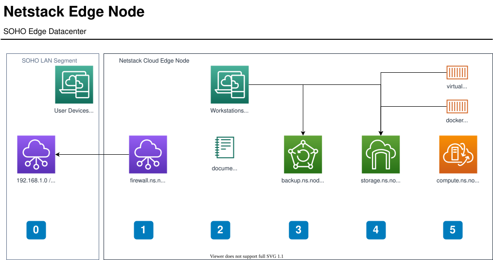

[edit](https://github.com/2cld/netstack/edit/master/docs/lan/README.md)

# LAN Overview

## Netstack Pillars
Netstack focuses on three technology pillars. The network IP scheme below is an opinionated map for primary gateways, secondaries, backups and documents.

- Pillar 1 - [Network - ng](./network/) 
- Pillar 2 - [Storage - sg](./storage/) 
- Pillar 3 - [Compute - cg](./compute/) 

This gateway model is the organizing principle for each site's `site-config.yml` — see the [site-config.yml Schema](../ops/deployments/site-config-schema.md). The IP map below is a **convention** (a self-documenting hint when you control address assignment), not a hard requirement: gateways are declared by **function**, and their actual IP is whatever it happens to be.

## Standard IP Map

| IP | lan | purpose |
|----|-----|---------|
| x.x.x.1 | ng.ns.lan | ng - network gateway |
| x.x.x.2 | sg.ns.lan | sg - storage gateway |
| x.x.x.3 | cg.ns.lan | cg - compute gateway |
| x.x.x.4 | bg2.ns.lan | bg - backups gateway secondary |
| x.x.x.5 | ng2.ns.lan | ng - network gateway secondary |
| x.x.x.6 | sg2.ns.lan | sg - storage gateway secondary |
| x.x.x.7 | cg2.ns.lan | cg - compute gateway secondary |
| x.x.x.8 | bg.ns.lan | bg - backups gateway |
| x.x.x.9 | dg.ns.lan | dg - documents gateway |

## Deployment Sites

| nslocation | subnet | gateway | PIP | note |
|------------|--------|---------|-----|------|
| cf.ns.lan  | 192.168.6.0/24 | 192.168.6.1 | 192.111.21.62 | cedar-falls (Fletch) |
| sl.ns.lan  | 192.168.1.0/24 | 192.168.1.1 | 24.216.208.251 | silver-lake — ISP DHCP (Spectrum modem), NOT operator-controlled |
| wf.ns.lan  | 192.168.254.0/24 (unverified) | 192.168.254.254 | x.x.x.x | winfield mikrotik — see note |

> ⚠️ **Subnet reconciliation (netstack#28):**
> - **cf** — `192.168.6.0/24` consistent.
> - **sl** — resolved 2026-09-25 (operator-confirmed): `192.168.1.0/24`, gw `192.168.1.1`
>   (Spectrum modem). The repo `site-config.yml` was correct; this table's old
>   `192.168.0.0/24`/`192.168.9.0/24` entry was wrong and is now fixed. sl runs on **ISP DHCP the
>   operator does NOT control** — exactly why the gateway model maps *function, not IP*.
>   slwin11ops LAN `192.168.1.194`; primary ZT `10.147.17.94` (secondary ZT net `10.147.19.13`).
> - **wf** — still unverified: table says `192.168.254.0/24` vs config `192.168.9.0/24`.
>   Needs operator confirmation before normalizing. Do not treat the wf row as authoritative yet.

Site-specific details: [ops/deployments](../ops/deployments/)

## LAN Sections

- [Network](./network/) - gateways, routing, subnets
  - [pfsense](./network/pfsense/)
  - [mikrotik](https://github.com/2cld/mikrotik)
- [Storage](./storage/) - NAS, file shares
  - [freenas / truenas](./storage/freenas/)
  - [qnap](./storage/qnap/)
  - [synology](./storage/synology/)
- [Compute](./compute/) - hypervisors, containers, workstations
  - [proxmox](./compute/proxmox/)
  - [docker](./compute/docker/)
  - [workstation](./compute/workstation/)
  - [xcp-ng](./compute/xcp-ng/)

## References
- [https://whatismyipaddress.com/](https://whatismyipaddress.com/)
- SSH-tunnels [source article](https://www.techtarget.com/searchsecurity/tutorial/How-to-use-SSH-tunnels-to-cross-network-boundaries)
- [Netstack docs](https://netstack.org/docs/)
