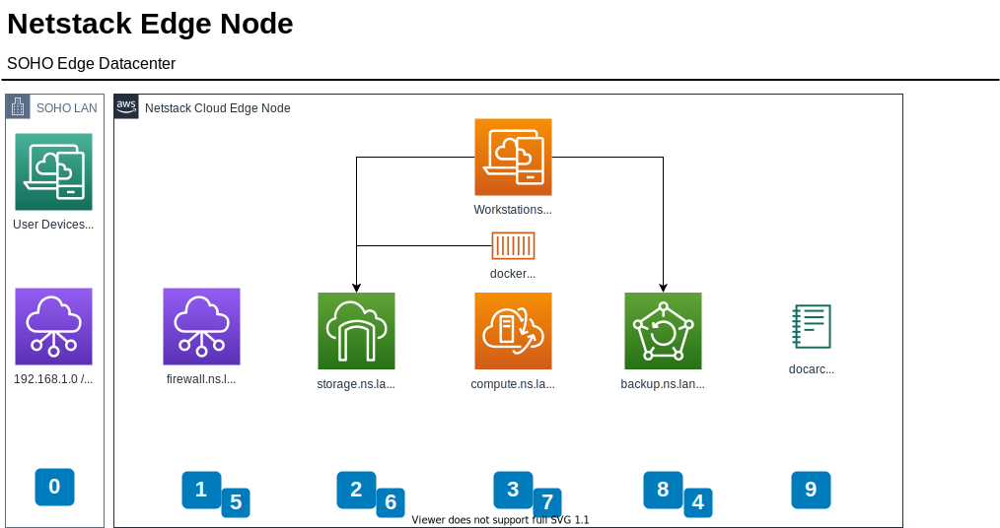

[edit](https://github.com/2cld/netstack/edit/master/docs/lan/README.md)

## nslocation.domain.com
- [https://whatismyipaddress.com/](https://whatismyipaddress.com/)
- example -- 173.191.244.125 -- example
- [https://whatismyipaddress.com/ip/173.191.244.125](https://whatismyipaddress.com/ip/173.191.244.125) 
- SSH-tunnels [source article](https://www.techtarget.com/searchsecurity/tutorial/How-to-use-SSH-tunnels-to-cross-network-boundaries)

## LAN nslocation.nsname.lan 

| nslocation | subnet |  gateway | admin | PIP | note |
|------------|--------|----------|-------|-----|------|
| mv.ns.lan  | 192.168.254.0/24 | 192.168.254.254 | [http://192.168.254.254/](http://192.168.254.254/) | x.x.x.x | mountainview pfsense |
| cf.ns.lan  | 192.168.254.0/24 | 192.168.254.254 | [http://192.168.254.254/](http://192.168.254.254/) | 173.191.244.125 | cedar-falls vendor|
| wf.ns.lan  | 192.168.254.0/24 | 192.168.254.254 | [http://192.168.254.254/](http://192.168.254.254/) | x.x.x.x | winfield mikrotik |

| resource    | link   | notes |
|-------------|--------|-------|
| mv dhcp-res | [http://192.168.254.254/advancedsetup_dhcpreservation.html](http://192.168.254.254/advancedsetup_dhcpreservation.html) | dhcp active reservations |
| wf dhcp-res | [http://192.168.254.254/advancedsetup_dhcpreservation.html](http://192.168.254.254/advancedsetup_dhcpreservation.html) | dhcp active reservations |


| web proxy    |   Link  | type | description |
|--------------|---------|------|-------------|
| windstream | [https://173.191.244.125/](https://173.191.244.125/) | static | windstream public IP |
|--------------|---------|------|-------------|
| windstream | [http://192.168.254.254/](http://192.168.254.254/) | static | windstream gw |
| ngbuMikrotik | [http://192.168.254.124/](http://192.168.254.124/) | dhcp-res | ns backup gw |
| ngMikrotik | [http://192.168.254.125/](http://192.168.254.125/) | dhcp-res | ns gw |
| ~~nginx default~~ | [http://192.168.6.103/](http://192.168.6.103/) | static | default nginx proxy page running in portainer |
| ~~nginx proxy admin~~ | [http://192.168.6.103:81](http://192.168.6.103:81) | static | admin for nginx running in portainer |
|--------------|---------|------|-------------|
| ~~proxmox admin~~ | [https://192.168.6.103:8006](https://192.168.6.103:8006) | static | proxmox running on metal 192.168.2.3 IP |


## 192.168.2.0/24 gw [http://192.168.2.1/](http://192.168.2.1/)
  
| web proxy    |   Link  | type | description |
|--------------|---------|------|-------------|
| [https://ng.ns.lan/](https://ng.ns.lan/) | [http://192.168.2.1/](http://192.168.2.1/) | static | [docs ng.ns.lan](./compute/mikrotik/) mikrotik vrrp ns gw |
| truenas | [http://192.168.2.2/](http://192.168.2.2/) | static | truenas sg on subnet |
| proxmox | [https://192.168.2.3:8006/](https://192.168.2.3:8006/) | static | proxmox cg subnet |
| ~~nginx default~~ | [http://192.168.2.103/](http://192.168.2.103/) | static | ~~default nginx proxy page running in portainer~~ |
| ~~nginx proxy admin~~ | [http://192.168.2.103:81](http://192.168.2.103:81) | macDHCP | ~~admin for nginx running in portainer~~ |
| portainer admin | [http://192.168.2.103:9000](http://192.168.2.103:9000) | macDHCP | portainer admin on proxmox docker 103 |
| ~~dockerplex web~~ | [http://192.168.2.103:32400](http://192.168.2.103:32400) | ~~macDHCP | 32400 on IP plex on portainer~~ |
| ~~tnasplex web~~ | [http://192.168.2.2:32500](http://192.168.2.2:32500) | static | ~~32500 on IP plex on portainer~~ |
| nswin11 | [http://192.168.2.195](http://192.168.2.195) | static | windows 11 vm-400 |

## proxmox [https://192.168.2.3:8006/](https://192.168.2.3:8006/) phy and virtio

| cg Name |   CIDR            |  gw          | pt/slv/brg  | ID   |  type          | description |
|---------|-------------------|--------------|-------------|------|----------------|-------------|
| enp60f0 | -                 | -            | -           | -    | Network Device | phy port left |
| enp60f1 | -                 | -            | -           | -    | Network Device | phy port right |
| vmbr0   | 192.168.2.3/24    | 192.168.2.1  | enp60f0     | -    | Linux Bridge   | vio bridge |
| vmbr1   | 192.168.254.0/24  | -            | enp60f1     | -    | Linux Bridge   | vio bridge |
|---------|-------------------|--------------|-------------|------|----------------|-------------|
| __ct-100__  | ssh -p 22 admin@192.168.2.100 |  gw          | pt/slv/brg  | ID   |  type          | description |
| eth0    | 192.168.2.100/24  | 192.168.2.1  | vmbr0       | net0 | ct-100 eth0    | ct-100 (ubuntu) eth0 |
|---------|-------------------|--------------|-------------|------|----------------|-------------|
| __ct-103__  | ssh -p 22 admin@192.168.2.103 |  gw          | pt/slv/brg  | ID   |  type          | description |
| eth0    | 192.168.2.103/24  | 192.168.2.1  | vmbr0       | net0 | ct-103 eth0    | ct-103 (docker) eth0 |
|---------|-------------------|--------------|-------------|------|----------------|-------------|
| __vm-101__  | ssh -p 22 admin@192.168.2.4 |  gw          | pt/slv/brg  | ID   |  type          | description |
| ether1  | 192.168.2.4/24    | 192.168.2.1  | vmbr1       | net0 | vm-101 ether1  | vm-101 (ngMiktrotik) ether1 |
| ether2  | 192.168.254.195/24| -            | vmbr1       | net1 | vm-101 ether2  | vm-101 (ngMiktrotik) ether2 |
| ether3  | -                 | -            | vmbr0       | net2 | vm-101 ether3  | vm-101 (ngMiktrotik) ether3 |
|---------|-------------------|--------------|-------------|------|----------------|-------------|
| __vm-102__  | ssh -p 22 admin@192.168.2.2 |  gw          | pt/slv/brg  | ID   |  type          | description |
| ether1  | 192.168.2.4/24    | 192.168.2.1  | vmbr1       | net0 | vm-101 ether1  | vm-101 (truenas) ether1 |
| ether2  | -                 | -            | vmbr1       | net1 | vm-101 ether2  | vm-101 (truenas) ether2 |
|---------|-------------------|--------------|-------------|------|----------------|-------------|
| __vm-400__  | ssh -p 22 admin@192.168.2.4 |  gw          | pt/slv/brg  | ID   |  type          | description |
| ether1  | 192.168.2.4/24    | 192.168.2.1  | vmbr1       | net0 | vm-101 ether1  | vm-101 (ngMiktrotik) ether1 |

- ubuntu 192.168.2.100
  ```
  ssh -p 22 admin@192.168.2.100
  ```
- docker 
  ```
  ssh -p 22 admin@192.168.2.103
  ``` 
  - portainer ui [http://192.168.2.103:9000](http://192.168.2.103:9000)
- nsMikrotik
  - lan-> 192.168.2.4
  ```
  ssh -p 22 admin@192.168.2.4
  ``` 
  - wan-> 192.168.254.195
  ```
  ssh -p 22 admin@192.168.254.195
  ```
  

---
---

# old Refernce
[documents index](../)

- [Netstack - freenas](./storage/freenas)
- [Netstack - freenas - setup](./storage/freenas/setup)
- [Netstack - NFS - Windows Client](./storage/windows)
- [Netstack - SMB - Windows Client](./storage/windows)

# LAN Overview



| IP | lan | purpose |
|----|-----|---------|
| [https://192.168.128.1](https://192.168.128.1) | [https://ng.ns.lan](https://ng.ns.lan) | ng - network gateway | 
| [https://192.168.128.2](https://192.168.128.2) | [https://sg.ns.lan](https://sg.ns.lan) | sg - storage gateway | 
| [https://192.168.128.3](https://192.168.128.3) | [https://cg.ns.lan](https://cg.ns.lan) | cg - compute gateway | 
| [https://192.168.128.4](https://192.168.128.4) | [https://bg2.ns.lan](https://bg2.ns.lan) | bg - backups gateway secondary|
| [https://192.168.128.5](https://192.168.128.5) | [https://ng2.ns.lan](https://ng2.ns.lan) | ng - network gateway secondary| 
| [https://192.168.128.6](https://192.168.128.6) | [https://sg2.ns.lan](https://sg2.ns.lan) | sg - storage gateway secondary| 
| [https://192.168.128.7](https://192.168.128.7) | [https://cg2.ns.lan](https://cg2.ns.lan) | cg - compute gateway secondary| 
| [https://192.168.128.8](https://192.168.128.8) | [https://bg.ns.lan](https://bg.ns.lan) | bg - backups gateway |
| [https://192.168.128.9](https://192.168.128.9) | [https://dg.ns.lan](https://dg.ns.lan) | dg - documents gateway | 

Current netstack proceedure is to use [https://domains.google/](https://domains.google/) and [github pages](https://github.com) for community documents.  [Netstack https://netstack.org/docs](https://netstack.org/docs/)

## Netstack basics
Netstacks focuses on the three technology pilars.  The above network IP is an opinionated map for the primary gateways, secondaries, backups and documents.

- Pilar 1 - [Network - pfsense](./network/pfsense/) [pfsense.org](https://www.pfsense.org/)
- Pilar 2 - [Storage - freenas](./storage/freenas/) [freenas.org](https://www.freenas.org/)
- Pilar 3 - [Compute - xcp-ng](./compute/xcp-ng/) [xcp-ng.org](https://xcp-ng.org/)

## Netstack service
