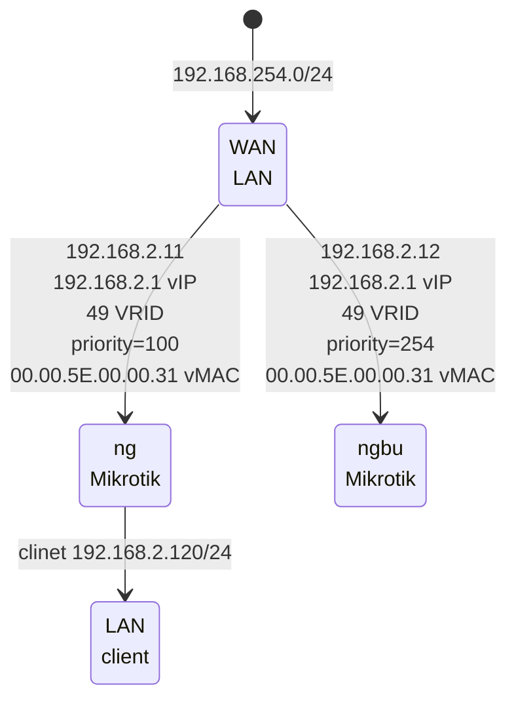

[edit](https://github.com/2cld/netstack/tree/master/docs/lan/compute/proxmox)

- [Proxmox Install](#Proxmox-Install)
- [Proxmox TrueNAS Install](#Proxmox-TrueNAS-Install)
  - [proxmox truenas import existing pool](#proxmox-truenas-import-existing-pool)

# ns proxmox deployments 
resource maps based on [https://netstack.org/docs/lan/README.md](https://netstack.org/docs/lan/README.md)
- cf [https://cf.christrees.com/ns/](https://cf.christrees.com/ns/)
- gh [https://gh.2cld.net/docs/](https://gh.2cld.net/docs/)

# Proxmox Install
- Review [https://tteck.github.io/Proxmox/](https://tteck.github.io/Proxmox/) to find resources you want to run on proxmox
- Identify static IP for proxmox node example 192.168.2.3/24
- Boot Ventoy USB - select proxmox install
- From [https://tteck.github.io/Proxmox/](https://tteck.github.io/Proxmox/) -> Proxmox VE Tools -> Proxmox VE 7 Post Install 
  - github [https://github.com/tteck/Proxmox/blob/main/misc/post-pve-install.sh](https://github.com/tteck/Proxmox/blob/main/misc/post-pve-install.sh)
  - run from cg node console shell
  ```
  bash -c "$(wget -qLO - https://github.com/tteck/Proxmox/raw/main/misc/post-pve-install.sh)"
  ```
- From [https://tteck.github.io/Proxmox/](https://tteck.github.io/Proxmox/) -> Operating System -> Ubuntu
  - github [https://github.com/tteck/Proxmox/blob/main/ct/ubuntu.sh](https://github.com/tteck/Proxmox/blob/main/ct/ubuntu.sh)
  - ran from cg node console shell
  - set static IP 192.168.2.3/24 (or IP via IPA plan)
  ```
  bash -c "$(wget -qLO - https://github.com/tteck/Proxmox/raw/main/ct/ubuntu.sh)"
  ```
- From [https://tteck.github.io/Proxmox/](https://tteck.github.io/Proxmox/) -> Docker - Kubernetes -> Docker LXC
  - github [https://github.com/tteck/Proxmox/blob/main/ct/docker.sh](https://github.com/tteck/Proxmox/blob/main/ct/docker.sh)
  - ran from cg node console shell
  - set static IP 192.168.2.103/24 (or IP via IPA plan)
  ```
  bash -c "$(wget -qLO - https://github.com/tteck/Proxmox/raw/main/ct/docker.sh)"
  ```
  - Portainer UI at [http://192.168.2.103:9000/](http://192.168.6.103:9000/) 
- From [https://tteck.github.io/Proxmox/](https://tteck.github.io/Proxmox/) -> Server - Networking -> Mikrotik RouterOS VM
  - github [https://github.com/tteck/Proxmox/raw/main/vm/mikrotik-routeros.sh](https://github.com/tteck/Proxmox/raw/main/vm/mikrotik-routeros.sh)
  - ran from cg node console shell
  ```
  bash -c "$(wget -qLO - https://github.com/tteck/Proxmox/raw/main/vm/mikrotik-routeros.sh)"
  ```
- From [https://tteck.github.io/Proxmox/](https://tteck.github.io/Proxmox/) -> Media - Photo -> Plex Media Server LXC
  - github [https://github.com/tteck/Proxmox/raw/main/ct/plex.sh)](https://github.com/tteck/Proxmox/blob/main/ct/plex.sh)
  - ran from cg node console shell
  - set static IP 192.168.2.105/24 (or IP via IPA plan)
  ```
  bash -c "$(wget -qLO - https://github.com/tteck/Proxmox/raw/main/ct/plex.sh)"
  ```
  - Plex UI at [http://192.168.2.105:3400/](http://192.168.6.105:9000/)
  - Claim webserver
  - Add storage
 
## Proxmox service map for 192.168.2.0/24 gw [http://192.168.2.1/](http://192.168.2.1/)
  
| web proxy    |   Link  | type | description |
|--------------|---------|------|-------------|
| [https://ng.ns.lan/](https://ng.ns.lan/) | [http://192.168.2.1/](http://192.168.2.1/) | static | [docs ng.ns.lan](./compute/mikrotik/) mikrotik vrrp ns gw |
| truenas | [http://192.168.2.2/](http://192.168.2.2/) | static | truenas sg on subnet |
| proxmox | [https://192.168.2.3:8006/](https://192.168.2.3:8006/) | static | proxmox cg subnet |
| ~~nginx default~~ | [http://192.168.2.103/](http://192.168.2.103/) | static | ~~default nginx proxy page running in portainer~~ |
| ~~nginx proxy admin~~ | [http://192.168.2.103:81](http://192.168.2.103:81) | macDHCP | ~~admin for nginx running in portainer~~ |
| portainer admin | [http://192.168.2.103:9000](http://192.168.2.103:9000) | macDHCP | portainer admin on proxmox docker 103 |
| ~~dockerplex web~~ | [http://192.168.2.103:32400](http://192.168.2.103:32400) | ~~macDHCP | 32400 on IP plex on portainer~~ |
| ~~tnasplex web~~ | [http://192.168.2.2:32500](http://192.168.2.2:32500) | static | ~~32500 on IP plex on portainer~~ |
| nswin11 | [http://192.168.2.195](http://192.168.2.195) | static | windows 11 vm-400 |

## proxmox [https://192.168.2.3:8006/](https://192.168.2.3:8006/) phy and virtio

| cg Name |   CIDR            |  gw          | pt/slv/brg  | ID   |  type          | description |
|---------|-------------------|--------------|-------------|------|----------------|-------------|
| enp60f0 | -                 | -            | -           | -    | Network Device | phy port left |
| enp60f1 | -                 | -            | -           | -    | Network Device | phy port right |
| vmbr0   | 192.168.2.3/24    | 192.168.2.1  | enp60f0     | -    | Linux Bridge   | vio bridge |
| vmbr1   | 192.168.254.0/24  | -            | enp60f1     | -    | Linux Bridge   | vio bridge |
|---------|-------------------|--------------|-------------|------|----------------|-------------|
| __ct-100__  | ssh -p 22 admin@192.168.2.100 |  gw          | pt/slv/brg  | ID   |  type          | description |
| eth0    | 192.168.2.100/24  | 192.168.2.1  | vmbr0       | net0 | ct-100 eth0    | ct-100 (ubuntu) eth0 |
|---------|-------------------|--------------|-------------|------|----------------|-------------|
| __ct-103__  | ssh -p 22 admin@192.168.2.103 |  gw          | pt/slv/brg  | ID   |  type          | description |
| eth0    | 192.168.2.103/24  | 192.168.2.1  | vmbr0       | net0 | ct-103 eth0    | ct-103 (docker) eth0 |
|---------|-------------------|--------------|-------------|------|----------------|-------------|
| __vm-101__  | ssh -p 22 admin@192.168.2.4 |  gw          | pt/slv/brg  | ID   |  type          | description |
| ether1  | 192.168.2.4/24    | 192.168.2.1  | vmbr1       | net0 | vm-101 ether1  | vm-101 (ngMiktrotik) ether1 |
| ether2  | 192.168.254.195/24| -            | vmbr1       | net1 | vm-101 ether2  | vm-101 (ngMiktrotik) ether2 |
| ether3  | -                 | -            | vmbr0       | net2 | vm-101 ether3  | vm-101 (ngMiktrotik) ether3 |
|---------|-------------------|--------------|-------------|------|----------------|-------------|
| __vm-102__  | ssh -p 22 admin@192.168.2.2 |  gw          | pt/slv/brg  | ID   |  type          | description |
| ether1  | 192.168.2.4/24    | 192.168.2.1  | vmbr1       | net0 | vm-101 ether1  | vm-101 (truenas) ether1 |
| ether2  | -                 | -            | vmbr1       | net1 | vm-101 ether2  | vm-101 (truenas) ether2 |
|---------|-------------------|--------------|-------------|------|----------------|-------------|
| __vm-400__  | ssh -p 22 admin@192.168.2.4 |  gw          | pt/slv/brg  | ID   |  type          | description |
| ether1  | 192.168.2.4/24    | 192.168.2.1  | vmbr1       | net0 | vm-101 ether1  | vm-101 (ngMiktrotik) ether1 |

- ubuntu 192.168.2.100
  ```
  ssh -p 22 admin@192.168.2.100
  ```
- docker 
  ```
  ssh -p 22 admin@192.168.2.103
  ``` 
  - portainer ui [http://192.168.2.103:9000](http://192.168.2.103:9000)
- nsMikrotik
  - lan-> 192.168.2.4
  ```
  ssh -p 22 admin@192.168.2.4
  ``` 
  - wan-> 192.168.254.195
  ```
  ssh -p 22 admin@192.168.254.195
  ```

## Proxmox TrueNAS Install
- qm list
- vzdump 102
- /var/lib/vzdump/vzdump_qemu_102_YYYY_MM_DD-HH_MM_SS.vma .log
- map IP to IPA plan
- [http://192.168.252.12/](http://192.168.252.12/)
- [https://pve.proxmox.com/wiki/Passthrough_Physical_Disk_to_Virtual_Machine_(VM)](https://pve.proxmox.com/wiki/Passthrough_Physical_Disk_to_Virtual_Machine_(VM))
- [VM disk passthrough video](https://youtu.be/MkK-9_-2oko?t=274)
- Install on proxmox node
```
apt install lshw
```
```
lshw -class disk -class storage
```
```
lsblk |awk 'NR==1{print $0" DEVICE-ID(S)"}NR>1{dev=$1;printf $0" ";system("find /dev/disk/by-id -lname \"*"dev"\" -printf \" %p\"");print "";}'|grep -v -E 'part|lvm'
```
- copy disk info

```
root@cg:~# lshw -class disk -class storage
  *-sata
       description: SATA controller
       product: 88SE9128 PCIe SATA 6 Gb/s RAID controller with HyperDuo
       vendor: Marvell Technology Group Ltd.
       physical id: 0
       bus info: pci@0000:08:00.0
       logical name: scsi7
       logical name: scsi13
       version: 11
       width: 32 bits
       clock: 33MHz
       capabilities: sata pm msi pciexpress ahci_1.0 bus_master cap_list rom emulated
       configuration: driver=ahci latency=0
       resources: irq:33 ioport:c040(size=8) ioport:c030(size=4) ioport:c020(size=8) ioport:c010(size=4) ioport:c000(size=16) memory:fb410000-fb4107ff memory:fb400000-fb40ffff
     *-disk
          description: ATA Disk
          product: WDC  WDBNCE5000P
          vendor: Western Digital
          physical id: 0
          bus info: scsi@7:0.0.0
          logical name: /dev/sde
          version: 00WD
          serial: 19272Q446913
          size: 465GiB (500GB)
          capabilities: gpt-1.00 partitioned partitioned:gpt
          configuration: ansiversion=5 guid=d49c6931-4d94-4061-928f-e93b31b01298 logicalsectorsize=512 sectorsize=512
  *-sata
       description: SATA controller
       product: C600/X79 series chipset 6-Port SATA AHCI Controller
       vendor: Intel Corporation
       physical id: 1f.2
       bus info: pci@0000:00:1f.2
       logical name: scsi2
       logical name: scsi3
       logical name: scsi4
       logical name: scsi5
       version: 06
       width: 32 bits
       clock: 66MHz
       capabilities: sata msi pm ahci_1.0 bus_master cap_list emulated
       configuration: driver=ahci latency=0
       resources: irq:32 ioport:f090(size=8) ioport:f080(size=4) ioport:f070(size=8) ioport:f060(size=4) ioport:f020(size=32) memory:fb625000-fb6257ff
     *-disk:0
          description: ATA Disk
          product: ST4000DM005-2DP1
          physical id: 0
          bus info: scsi@2:0.0.0
          logical name: /dev/sda
          version: 0001
          serial: ZDH1XZRW
          size: 3726GiB (4TB)
          configuration: ansiversion=5 logicalsectorsize=512 sectorsize=4096
     *-disk:1
          description: ATA Disk
          product: WDC WD40EZRZ-00G
          vendor: Western Digital
          physical id: 1
          bus info: scsi@3:0.0.0
          logical name: /dev/sdb
          version: 0A80
          serial: WD-WCC7K7ZHJNLJ
          size: 3726GiB (4TB)
          configuration: ansiversion=5 logicalsectorsize=512 sectorsize=4096
     *-disk:2
          description: ATA Disk
          product: ST4000DM005-2DP1
          physical id: 2
          bus info: scsi@4:0.0.0
          logical name: /dev/sdc
          version: 0001
          serial: ZGY0H6BY
          size: 3726GiB (4TB)
          configuration: ansiversion=5 logicalsectorsize=512 sectorsize=4096
     *-disk:3
          description: ATA Disk
          product: ST4000DM005-2DP1
          physical id: 3
          bus info: scsi@5:0.0.0
          logical name: /dev/sdd
          version: 0001
          serial: ZGY0H29Y
          size: 3726GiB (4TB)
          configuration: ansiversion=5 logicalsectorsize=512 sectorsize=4096
root@cg:~#
```
- create mapping
  - sda ZDH1XZRW ata-ST4000DM005-2DP166_ZDH1XZRW
  - sdb WD-WCC7K7ZHJNLJ ata-WDC_WD40EZRZ-00GXCB0_WD-WCC7K7ZHJNLJ
  - sdc ZGY0H6BY ata-ST4000DM005-2DP166_ZGY0H6BY
  - sdd ZGY0H29Y ata-ST4000DM005-2DP166_ZGY0H29Y
- add drives to vm 102 (truenas vm id)
  - qm set 102 -scsi1 /dev/disk/by-id/ata-ST4000DM005-2DP166_ZDH1XZRW
  - qm set 102 -scsi2 /dev/disk/by-id/ata-WDC_WD40EZRZ-00GXCB0_WD-WCC7K7ZHJNLJ
  - qm set 102 -scsi3 /dev/disk/by-id/ata-ST4000DM005-2DP166_ZGY0H6BY
  - qm set 102 -scsi4 /dev/disk/by-id/ata-ST4000DM005-2DP166_ZGY0H29Y
- proxmox cli
```
root@cg:~# qm set 102 -scsi1 /dev/disk/by-id/ata-ST4000DM005-2DP166_ZDH1XZRW
update VM 102: -scsi1 /dev/disk/by-id/ata-ST4000DM005-2DP166_ZDH1XZRW
root@cg:~# qm set 102 -scsi2 /dev/disk/by-id/ata-WDC_WD40EZRZ-00GXCB0_WD-WCC7K7ZHJNLJ
update VM 102: -scsi2 /dev/disk/by-id/ata-WDC_WD40EZRZ-00GXCB0_WD-WCC7K7ZHJNLJ
root@cg:~# qm set 102 -scsi3 /dev/disk/by-id/ata-ST4000DM005-2DP166_ZGY0H6BY
update VM 102: -scsi3 /dev/disk/by-id/ata-ST4000DM005-2DP166_ZGY0H6BY
root@cg:~# qm set 102 -scsi4 /dev/disk/by-id/ata-ST4000DM005-2DP166_ZGY0H29Y
update VM 102: -scsi4 /dev/disk/by-id/ata-ST4000DM005-2DP166_ZGY0H29Y
root@cg:~#
```
- proxmox vm 101 [https://192.168.252.3:8006/#v1:0:=qemu%2F102:4:=jsconsole::::7:9:](https://192.168.252.3:8006/#v1:0:=qemu%2F102:4:=jsconsole::::7:9:)
- put serial numbers in 

### proxmox truenas import existing pool
- [https://www.truenas.com/docs/core/coretutorials/storage/importdisk/](https://www.truenas.com/docs/core/coretutorials/storage/importdisk/)
- [https://www.truenas.com/docs/core/coretutorials/storage/pools/poolimport/](https://www.truenas.com/docs/core/coretutorials/storage/pools/poolimport/)
- map drives to vm see above [./#proxmox-truenas-install](./#proxmox-truenas-install)
- Storage > Pools > ADD
- tbd


## proxmox backup and restore vm
- [https://pve.proxmox.com/wiki/Backup_and_Restore](https://pve.proxmox.com/wiki/Backup_and_Restore)
- qm list
- vzdump 400
- /var/lib/vzdump/vzdump_qemu_400_YYYY_MM_DD-HH_MM_SS.vma .log
- scp /var/lib/vzdump/vzdump...x.vma root@192.168.2.2:/var/lib/vzdump/
- qmrestore /mnt/backup/vzdump-qemu-400.vma 400

---
---
---

## proxmox [https://192.168.2.3:8006/](https://192.168.2.3:8006/) phy and virtio

| cg Name |   CIDR            |  gw          | pt/slv/brg  | ID   |  type          | description |
|---------|-------------------|--------------|-------------|------|----------------|-------------|
| enp60f0 | -                 | -            | -           | -    | Network Device | phy port left |
| enp60f1 | -                 | -            | -           | -    | Network Device | phy port right |
| vmbr0   | 192.168.2.3/24    | 192.168.2.1  | enp60f0     | -    | Linux Bridge   | vio bridge |
| vmbr1   | 192.168.254.0/24  | -            | enp60f1     | -    | Linux Bridge   | vio bridge |
|---------|-------------------|--------------|-------------|------|----------------|-------------|
| __ct-100__  | ssh -p 22 admin@192.168.2.100 |  gw          | pt/slv/brg  | ID   |  type          | description |
| eth0    | 192.168.2.100/24  | 192.168.2.1  | vmbr0       | net0 | ct-100 eth0    | ct-100 (ubuntu) eth0 |
|---------|-------------------|--------------|-------------|------|----------------|-------------|
| __ct-103__  | ssh -p 22 admin@192.168.2.103 |  gw          | pt/slv/brg  | ID   |  type          | description |
| eth0    | 192.168.2.103/24  | 192.168.2.1  | vmbr0       | net0 | ct-103 eth0    | ct-103 (docker) eth0 |
|---------|-------------------|--------------|-------------|------|----------------|-------------|
| __vm-101__  | ssh -p 22 admin@192.168.2.4 |  gw          | pt/slv/brg  | ID   |  type          | description |
| ether1  | 192.168.2.4/24    | 192.168.2.1  | vmbr1       | net0 | vm-101 ether1  | vm-101 (ngMiktrotik) ether1 |
| ether2  | 192.168.254.195/24| -            | vmbr1       | net1 | vm-101 ether2  | vm-101 (ngMiktrotik) ether2 |
| ether3  | -                 | -            | vmbr0       | net2 | vm-101 ether3  | vm-101 (ngMiktrotik) ether3 |
|---------|-------------------|--------------|-------------|------|----------------|-------------|
| __vm-102__  | ssh -p 22 admin@192.168.2.2 |  gw          | pt/slv/brg  | ID   |  type          | description |
| ether1  | 192.168.2.4/24    | 192.168.2.1  | vmbr1       | net0 | vm-101 ether1  | vm-101 (truenas) ether1 |
| ether2  | -                 | -            | vmbr1       | net1 | vm-101 ether2  | vm-101 (truenas) ether2 |
|---------|-------------------|--------------|-------------|------|----------------|-------------|
| __vm-400__  | ssh -p 22 admin@192.168.2.4 |  gw          | pt/slv/brg  | ID   |  type          | description |
| ether1  | 192.168.2.4/24    | 192.168.2.1  | vmbr1       | net0 | vm-101 ether1  | vm-101 (ngMiktrotik) ether1 |

- ubuntu 192.168.2.100
  ```
  ssh -p 22 admin@192.168.2.100
  ```
- docker 
  ```
  ssh -p 22 admin@192.168.2.103
  ``` 
  - portainer ui [http://192.168.2.103:9000](http://192.168.2.103:9000)
- nsMikrotik
  - lan-> 192.168.2.4
  ```
  ssh -p 22 admin@192.168.2.4
  ``` 
  - wan-> 192.168.254.195
  ```
  ssh -p 22 admin@192.168.254.195
  ```

## nsMikrotik [port forward](https://help.mikrotik.com/docs/display/RKB/Port+forwarding)
- IP -> Firewall | NAT tab
- chain: dstnat
- add dstnat - tcp - dst port: 8006 - in inter list: ether1-gateway actions: dst-nat - 192.168.2.3:8006 comment: proxmox port 8006 forward to 192.168.2.3:8006
- add dstnat - tcp - dst port: 8004 - in inter list: ether1-gateway actions: dst-nat - 192.168.2.2:80   comment: truenas port 8004 forware to 192.168.2.2:80
- add dstnat - tcp - dst port: 8002 - in inter list: ether1-gateway actions: dst-nat - 192.168.2.1:80   comment: mikrotik port 8002 forware to 192.168.2.1:80
- proxmox [https://192.168.2.3:8006](https://192.168.2.3:8006)
- truenas [https://192.168.2.3:8003](https://192.168.2.3:8003)
- mikrotik not working [https://192.168.2.3:8002](https://192.168.2.3:8002)

## nsMikrotik s/w
- s/w [https://192.168.254.124](https://192.168.254.124) 
- lan
```
ssh -p 22 admin@192.168.2.11
``` 
- wan
```
ssh -p 22 admin@192.168.254.125
```

| nsMikrotik |   CIDR            |  gw          | pt/slv/brg  | ID   |  type          | description |
|---------|-------------------|--------------|-------------|------|----------------|-------------|
| ether1  | 192.168.254.1/24  | 192.168.2.1  | vmbr1       | net0 | vm-101 ether1  | vm-101 (ngMiktrotik) ether1 |
| ether2  | -                 | -            | vmbr1       | net1 | vm-101 ether2  | vm-101 (ngMiktrotik) ether2 |
| ether3  | -                 | -            | vmbr0       | net2 | vm-101 ether3  | vm-101 (ngMiktrotik) ether3 |
 
## nsbuMikrotik h/w
- h/w [https://192.168.254.125](https://192.168.254.125) admin What#Time 
- lan
```
ssh -p 22 admin@192.168.2.12
``` 
- wan
```
ssh -p 22 admin@192.168.254.125
```

| nsbuMikrotik |   CIDR            |  gw          | pt/slv/brg  | ID   |  type          | description |
|---------|-------------------|--------------|-------------|------|----------------|-------------|
| ether1-gateway  | 192.168.254.1/24    | 192.168.2.1  | bridge-local       | net0 | vm-101 ether1  | vm-101 (ngMiktrotik) ether1 |
| ether2  | -                 | -            | vmbr1       | net1 | vm-101 ether2  | vm-101 (ngMiktrotik) ether2 |
| ether3  | -                 | -            | vmbr0       | net2 | vm-101 ether3  | vm-101 (ngMiktrotik) ether3 |

- Interfaces [http://192.168.254.124/webfig/#Interfaces.Interface](http://192.168.254.124/webfig/#Interfaces.Interface)
- Addresses [http://192.168.254.124/webfig/#IP:Addresses](http://192.168.254.124/webfig/#IP:Addresses)
- VRRP [http://192.168.254.124/webfig/#Interfaces.VRRP](http://192.168.254.124/webfig/#Interfaces.VRRP)
- 
## VRRP on hw and sw mikrotik
- [https://help.mikrotik.com/docs/display/ROS/VRRP+Configuration+Examples](https://help.mikrotik.com/docs/display/ROS/VRRP+Configuration+Examples)



### R1 ngMikrotik on proxmox
```
/ip address add address=192.168.2.11/24 interface=ether1
/interface vrrp add interface=ether1 vrid=49 priority=254
/ip address add address=192.168.2.1/32 interface=vrrp1
```

### R2 ngbuMikrotik on hardware
```
/ip address add address=192.168.2.12/24 interface=ether1-gateway
/interface vrrp add interface=ether1 vrid=49
/ip address add address=192.168.2.1/32 interface=vrrp1
```
/
### Testing
First of all, check if both routers have correct flags at VRRP interfaces. On router R1 it should look like this

#### R1 nsMikrotik
```
/interface vrrp print detail
 0   RM name="vrrp1" mtu=1500 mac-address=00:00:5E:00:01:31 arp=enabled interface=ether1 vrid=49
        priority=254 interval=1 preemption-mode=yes authentication=none password="" on-backup=""
        on-master="" version=3 v3-protocol=ipv4
```

#### R2 nsbuMikrotik
```
/interface vrrp print detail
 0    B name="vrrp1" mtu=1500 mac-address=00:00:5E:00:01:31 arp=enabled interface=ether1 vrid=49
        priority=100 interval=1 preemption-mode=yes authentication=none password=""
        on-backup="" on-master=" version=3 v3-protocol=ipv4
```

- MAC addresses are identical on both routers
- ping the virtual address from a client and check ARP entries:

```
[admin@client] > /ping 192.168.1.1
192.168.1.254 64 byte ping: ttl=64 time=10 ms
192.168.1.254 64 byte ping: ttl=64 time=8 ms
2 packets transmitted, 2 packets received, 0% packet loss
round-trip min/avg/max = 8/9.0/10 ms
[admin@client] /ip arp> print
Flags: X - disabled, I - invalid, H - DHCP, D - dynamic
 #   ADDRESS         MAC-ADDRESS       INTERFACE
 ...
 1 D 192.168.1.1   00:00:5E:00:01:31 bridge1
```

- unplug the ether1 cable on router R1
- R2 will become VRRP master, and the ARP table on a client will not change
- traffic will start to flow over the R2 router

## proxmox install mikrotik CHR on a Proxmox
- [Virtual Network in Proxmox for MPTCP Test lab](https://www.youtube.com/watch?v=S-Xmcig1ddA)
- [https://ostechnix.com/import-qcow2-into-proxmox/](https://ostechnix.com/import-qcow2-into-proxmox/)
- [https://wiki.mikrotik.com/wiki/Manual:CHR_ProxMox_installation](https://wiki.mikrotik.com/wiki/Manual:CHR_ProxMox_installation)
- [https://mikrotik.com/download](https://mikrotik.com/download)
- [https://dailymikrotik.blogspot.com/2015/08/commands-in-mikrotik-router-os.html](https://dailymikrotik.blogspot.com/2015/08/commands-in-mikrotik-router-os.html)
- [https://forum.proxmox.com/threads/vm-disk-location-cant-find-the-vm-disk.101118/](https://forum.proxmox.com/threads/vm-disk-location-cant-find-the-vm-disk.101118/)
- downloaded raw disk image chr-7.8.img.zip
- reference [https://gregsowell.com/?p=6051](https://gregsowell.com/?p=6051)
1. Go to the mikrotik download page (above) and grab the raw disk image chr-7.8.img.zip
2. Extract the img file and transfer it into your proxmox /root folder.
3. On proxmox issue the following “qm list”. Pick the next sequential number that isn’t already taken.
4. Create the directory for this VM: “mkdir /var/lib/vz/images/150”
5. Create the qcow2 image. Adjust the image name “/root/chr-6.44.3.img” to whatever you downloaded and adjust the VM number from 150 to whatever you choose “/var/lib/vz/images/150/vm-150-disk-1.qcow2”
```bash
qemu-img convert \
-f raw \
-O qcow2 \
/root/chr-6.44.3.img \
/var/lib/vz/images/150/vm-150-disk-1.qcow2
```
```bash
qm create 101 --name ngMikrotik --net0 virtio,bridge=vmbr1 --bootdisk virtio0 --ostype l26 --memory 256 --onboot no --sockets 1 --cores 1 --virtio0 local:101/vm-101-disk-1.qcow2
```
6. Create the VM inside of proxmox. Be sure to change the VM number “150” in all lines to yours and also adjust the name to whatever you prefer:
```bash
qm create 150 \
–name chr-cust1 \
–net0 virtio,bridge=vmbr0 \
–bootdisk virtio0 \
–ostype l26 \
–memory 256 \
–onboot no \
–sockets 1 \
–cores 1 \
–virtio0 local:150/vm-150-disk-1.qcow2
```
```bash
qm create 101 --name ngMikrotik --net0 virtio,bridge=vmbr1 --bootdisk virtio0 --ostype l26 --memory 256 --onboot
no --sockets 1 --cores 1 --virtio0 local:101/vm-101-disk-1.qcow2
```
### Enable mikrotik on proxmox local
- Enable images on cg local
  - Datacenter -> Storage -> local -> Edit Add "Disk image"
- Create qcow template directory
```bash
root@cg:~# mkdir /var/lib/vz/template/qcow/
```
- convert image
```bash
root@cg:~# qemu-img convert -f raw -O qcow2 /var/lib/vz/template/iso/chr-7.8.img /var/lib/vz/template/qcow/mikrotik-chr-7-8.qcow2
```
- Create vm without drive
```bash
qm create 101 --name ngMikrotik --net0 virtio,bridge=vmbr1 --bootdisk virtio0 --ostype l26 --memory 256 --onboot
no --sockets 1 --cores 1 
```
- Import qcow disk image
```bash
root@cg:~# cd /var/lib/vz/template/qcow/
root@cg:/var/lib/vz/template/qcow# qm importdisk 101 mikrotik-chr-7-8.qcow2 local
importing disk 'mikrotik-chr-7-8.qcow2' to VM 101 ...
Formatting '/var/lib/vz/images/101/vm-101-disk-0.raw', fmt=raw size=134217728 preallocation=off
transferred 0.0 B of 128.0 MiB (0.00%)
transferred 6.7 MiB of 128.0 MiB (5.21%)
transferred 10.5 MiB of 128.0 MiB (8.21%)
transferred 17.0 MiB of 128.0 MiB (13.27%)
transferred 22.2 MiB of 128.0 MiB (17.38%)
transferred 28.7 MiB of 128.0 MiB (22.43%)
transferred 35.2 MiB of 128.0 MiB (27.49%)
transferred 41.7 MiB of 128.0 MiB (32.54%)
transferred 48.1 MiB of 128.0 MiB (37.60%)
transferred 54.6 MiB of 128.0 MiB (42.65%)
transferred 61.1 MiB of 128.0 MiB (47.71%)
transferred 67.3 MiB of 128.0 MiB (52.61%)
transferred 70.6 MiB of 128.0 MiB (55.13%)
transferred 77.6 MiB of 128.0 MiB (60.66%)
transferred 84.1 MiB of 128.0 MiB (65.72%)
transferred 89.6 MiB of 128.0 MiB (69.98%)
transferred 96.1 MiB of 128.0 MiB (75.04%)
transferred 102.5 MiB of 128.0 MiB (80.09%)
transferred 109.0 MiB of 128.0 MiB (85.15%)
transferred 115.5 MiB of 128.0 MiB (90.21%)
transferred 119.1 MiB of 128.0 MiB (93.05%)
transferred 125.6 MiB of 128.0 MiB (98.10%)
transferred 127.0 MiB of 128.0 MiB (99.21%)
transferred 128.0 MiB of 128.0 MiB (100.00%)
transferred 128.0 MiB of 128.0 MiB (100.00%)
Successfully imported disk as 'unused0:local:101/vm-101-disk-0.raw'
root@cg:/var/lib/vz/template/qcow#
```
7. Login and verify

## proxmox firewall [proxmox cg node https://192.168.2.3:8006/](https://192.168.2.3:8006/)
- [proxmox-user-management](https://pve.proxmox.com/wiki/User_Management)
- [proxmox-firewall-youtube](https://www.youtube.com/watch?v=yA9e7A9v7Xc)
- [proxmox-NAT](https://bobcares.com/blog/setup-nat-on-proxmox/)
- [proxmox-firewall-docs](https://pve.proxmox.com/wiki/Firewall)
- [datacenter firewall https://192.168.2.3:8006/#v1:0:18:4:::::::32](https://192.168.2.3:8006/#v1:0:18:4:::::::32)
- tracert from cmd - CTRL+C will send a break (stop execution) when no text is selected
```powershell
tracert cf.christrees.com
```
- [rackn.io provision on proxmox](https://docs.rackn.io/en/latest/doc/content-packages/proxmox.html)

## proxmox install doc sync
- [https://netstack.org/docs/lan/compute/proxmox/](https://netstack.org/docs/lan/compute/proxmox/)
- [https://gh.2cld.net/docs/proxmox/](https://gh.2cld.net/docs/proxmox/)
- [https://cf.christrees.com/ns/](https://cf.christrees.com/ns/)
- From [https://tteck.github.io/Proxmox/](https://tteck.github.io/Proxmox/) 
  - github [https://github.com/tteck/Proxmox/blob/main/misc/post-pve-install.sh](https://github.com/tteck/Proxmox/blob/main/misc/post-pve-install.sh)
  - ran from cg node console shell
  ```
  bash -c "$(wget -qLO - https://github.com/tteck/Proxmox/raw/main/misc/post-pve-install.sh)"
  ```
  - github [https://github.com/tteck/Proxmox/blob/main/ct/ubuntu-v5.sh](https://github.com/tteck/Proxmox/blob/main/ct/ubuntu-v5.sh)
  - ran from cg node console shell
  - set static IP 192.168.2.100/24
  ```
  bash -c "$(wget -qLO - https://github.com/tteck/Proxmox/raw/main/ct/ubuntu-v5.sh)"
  ```
  - github [https://github.com/tteck/Proxmox/blob/main/ct/docker-v5.sh](https://github.com/tteck/Proxmox/blob/main/ct/docker-v5.sh)
  - ran from cg node console shell
  - set static IP 192.168.2.103/24
  ```
  bash -c "$(wget -qLO - https://github.com/tteck/Proxmox/raw/main/ct/docker-v5.sh)"
  ```
- [tbd]()
- [tbd]()
- [tbd]()

## proxmox windows11 vm nswin11
- References
  - [proxmox-windows11-vm](https://gulowsen.com/post/proxmox/proxmox-windows11-vm/)
  - [proxmox win11 drivers iso copy link](https://fedorapeople.org/groups/virt/virtio-win/direct-downloads/stable-virtio/virtio-win.iso)
  - [github for win11 driver](https://github.com/virtio-win/virtio-win-pkg-scripts)
- Create VM
  - Machine
    - Machine: Make sure machine is set to q35.
    - BIOS: Microsoft requires UEFI so use OVMF (UEFI).
    - Add EFI Disk and EFI Storage: EFI Disk should to be checked for Windows. It is a backup in case the boot part of windows gets corrupted. For EFI Disk you Should use the same storage as VM disk local-lvm.
    - SCSI Controller: Set this to VirtIO SCSI if not already.
    - Add TPM TPM is required for Windows 11 and Proxmox can virtualize it.
    - TPM Storage As EFI Storage this should point to local-lvm same disk for the VM on.
    - Version Make sure V2.0 is selected if you are installing Windows 11.
  - Drive
    - Bus Device: SCSI for compatibility.
    - Storage: local-lvm SSD same drive used in the previous steps.
    - Disk size: Microsoft minimum required drive size is 64 Gigabytes so give it that or more.
    - Cache: I set this to "write back" as it is the most stable option according to the Proxmox wiki.
  - CPU
    - Sockets: 1
    - Cores: 4 (half of the cores)
    - Type: Use "passthrough host" as the type
    - Extra CPU Flags: none
  - Memory
    - Memory: 8 gigabyte's of memory
    - Minimum memory: This is to make sure a VM will have enough memory for what you wish even if you enable ballooning.
    - Ballooning Device: Check this to enable Ballooning. When enabled, the VM will only be allocated the amount of memory it is actually using. This will give you the possibility to allocate more memory than you actually have, but be aware that this may cause start up problems and crashes.
  - Network
    - Bridge: This is the virtual network interface. You can add more after the initial setup.
    - VLAN Tag: Here you can enter a VLAN tag for which VLAN you wish your VM to be in. The tag is a number that can be between 1 and 4094.
    - Model: There are different types of network interface cards you can simulate. Most will make the VM think there is a cable connected. VirtIO will just come up as virtualized. Some operating systems may require one specific type.
    - MAC address: Here you are able to set a specific mac address if you require that.
    - Disconnect: Checking this simulates taking out a network cable. It can be helpful when you try different things and need to disconnect without deleting the entire network configuration.
  - DO NOT START VM
    - A: Select your windows VM in the server view.
    - B: Click Hardware
    - C: Clicking Add will open a drop down menu with additional hardware you can add. This includes both virtual and physical items.
    - D: To add the VirtIO ISO, click CD/DVD Drive.
    - E: Like when you configure the VM you can choose which storage and ISO image. Select the virtio-win.iso file.
    - F: Click Add to add the additional ISO addition.
  - tbd
- Install Windows
  - no key
  - Windows 11 Pro
  - Custom Install
  - Steps for adding the hard drive driver:
    - Start with Load driver. Then click Browse. Choose CD Drive virtio-win-"version".
    - Scroll down and expand vioscsi. Expand w11 folder for Windows 11, click amd64.
    - Click ok then next to install the driver. The hard drive should now show up in the setup window. 
  - Steps for adding the network driver:
    - Start with Load driver. Then click Browse. Choose CD Drive virtio-win-"version".
    - Scroll down and expand NetKVM. Expand w11 folder for Windows 11, click amd64.
    - Click ok then next to install the driver.  You will not see anything extra when this is installed but Windows will be able to do some updates during installation.
    - Next unless you wish to format the drive in a specific way click Next to continue.
- Setup Windows
  - Offline User To create an offline account simply click the options below in each menu.
    - A: Sign-in options
    - B: Offline account
    - C: Skip for now
  - Load Devices
    - run virtio-win-0.1.229/virtio-win-gt-x64.msi
    - Right click the start menu (Windows logo on the lower bar) Click Device Manager
    - Verify no PCI Device marked with and error.
    - If errors
      - Right click one of the devices with an error and click update driver.
      - In the window that opens, click Browse my computer for drivers.
      - On the next side click Browse.
      - In the file browser, navigate down to the virtio-win ISO and select it. You do not need to specify any drivers.
      - Click Next. Windows will go through the ISO and install the drivers it needs.
  - Remote Connection Enable
    - Start by right clicking the Windows start menu. Click Settings.
    - The System menu then scroll down to and click Remote Desktop
  - Guest Agent Install
    - [https://pve.proxmox.com/wiki/Qemu-guest-agent](https://pve.proxmox.com/wiki/Qemu-guest-agent)
    - Verify guest agent is enabled
    - Node (nswin11) Options -> QEMU Guest Agent : Enabled
    - run virtio-win-0.1.229/guest-agent/qemu-ga-x86-64.msi

- zerotier [https://www.zerotier.com/download/](https://www.zerotier.com/download/)
  - Install
  - join network
  - test


## zerotier 
- [zerotier on synology](https://docs.zerotier.com/devices/synology/)
- [zerotier on mikrotik download ARM64 extra packages](https://mikrotik.com/download)
- [zerotier on mikrotik help docs](https://help.mikrotik.com/docs/display/ROS/ZeroTier)

## iso rip
- bash "dd if=/dev/sr0 of=name_of_dvd.iso"
- [dvd_ripping_in_2019](https://www.reddit.com/r/DataHoarder/comments/cse88w/dvd_ripping_in_2019/)
- makeMKV Handbrake AnyDVD DVDFab 
- [https://b3n.org/automatic-ripping-machine/](https://b3n.org/automatic-ripping-machine/)
- [https://github.com/donmelton/video_transcoding](https://github.com/donmelton/video_transcoding)
- [https://hub.docker.com/r/jlesage/makemkv/](https://hub.docker.com/r/jlesage/makemkv/)
- [https://github.com/automatic-ripping-machine/automatic-ripping-machine](https://github.com/automatic-ripping-machine/automatic-ripping-machine)

- proxmox iso template storage
```bash
root@cg:~# ls /var/lib/vz/template/iso/
```

---
---
---

# old reference

- [https://www.proxmox.com/en/downloads/category/iso-images-pve](https://www.proxmox.com/en/downloads/category/iso-images-pve)
- [Youtube - Plex on ProxMox Tutorial WITH nVidia Hardware Encoding](https://www.youtube.com/watch?v=-HCzLhnNf-A&t=77s)
- [Youtube - Proxmox vGPU Gaming Tutorial - Share Your GPU With Multiple VMs](https://www.youtube.com/watch?v=cPrOoeMxzu0)
- [Youtube - Virtualizing An Internal Network With pfSense In ProxMox](https://www.youtube.com/watch?v=V6di1EAovN8)
- [Youtube - Virtualize Windows 10 with Proxmox VE](https://www.youtube.com/watch?v=6c-6xBkD2J4)
- [Youtube - Proxmox Full Course](https://www.youtube.com/playlist?list=PLT98CRl2KxKHnlbYhtABg6cF50bYa8Ulo)
- [Youtube - ]()
- [Youtube - ]()
- [Youtube - ]()
- [Youtube - ]()

## Network
- [ng - ASUS - http://192.168.2.1/Advanced_DHCP_Content.asp](http://192.168.2.1/Advanced_DHCP_Content.asp)
- [sg - truenas scale - http://192.168.2.2/ui/dashboard](http://192.168.2.2/ui/dashboard)
- [cg - proxmox - https://192.168.2.3:8006/](https://192.168.2.3:8006/)
- 
## Setup
- [Youtube - Before I do anything on Proxmox, I do this first](https://www.youtube.com/watch?v=GoZaMgEgrHw) commandline document [Techno Tim - Document](https://docs.technotim.live/posts/first-11-things-proxmox/) quickstart documents [Techno Tim - launchpad](https://github.com/techno-tim/launchpad)

- [01:26](https://www.youtube.com/watch?v=GoZaMgEgrHw&t=86s) Install the latest version of [Proxmox - iso-images-pve](https://www.proxmox.com/en/downloads/category/iso-images-pve)
- [01:51](https://www.youtube.com/watch?v=GoZaMgEgrHw&t=111s) How to update Proxmox without a subscription
    - ssh root@192.168.2.3
    - root@cg:~# vi /etc/apt/sources.list  add following
      ```
      # not for production
      deb http://download.proxmox.com/debian bullseye pve-no-subscription
      ```
    - vroot@cg:~# vi /etc/apt/sources.list.d/pve-enterprise.list  comment out line
      ```
      # deb https://enterprise.proxmox.com/debian/pve bullseye pve-enterprise
      ```      
    - root@cg:~# apt update
    - root@cg:~# apt dist-upgrade
    - This can be done through the UI under Update
- [03:10](https://www.youtube.com/watch?v=GoZaMgEgrHw&t=190s)  How to configure Proxmox storage (ZFS + RAID10)
- [05:32](https://www.youtube.com/watch?v=GoZaMgEgrHw&t=332s)  How to setup SMART monitoring with proxmox
- [06:18](https://www.youtube.com/watch?v=GoZaMgEgrHw&t=378s)  How to turn on PCI Passthrough with Proxmox (IOMMU)
    - [Plex on ProxMox Tutorial WITH nVidia](https://www.youtube.com/watch?v=-HCzLhnNf-A&t=679s)
    - [ProxMox PCIpassthrough docs](https://pve.proxmox.com/wiki/Pci_passthrough)
    - [Guide to GPU in ProxMox](https://www.reddit.com/r/homelab/comments/b5xpua/the_ultimate_beginners_guide_to_gpu_passthrough/)
    - Turn on VT-d in Bios
    - root@cg:~# vi /etc/default/grub
      ```
      GRUB_DEFAULT=0
      GRUB_TIMEOUT=5
      GRUB_DISTRIBUTOR=`lsb_release -i -s 2> /dev/null || echo Debian`
      # GRUB_CMDLINE_LINUX_DEFAULT="quiet"
      GRUB_CMDLINE_LINUX_DEFAULT="quiet intel_iommu=on"
      GRUB_CMDLINE_LINUX=""
      ```
    - root@cg:~# update-grub
    - root@cg:~# vi /etc/modules
      ```
      vfio
      vfio_iommu_type1
      vfio_pci
      vfio_virqfd
      ```
    - IOMMU interrupt remapping
      ```
      echo "options vfio_iommu_type1 allow_unsafe_interrupts=1" > /etc/modprobe.d/iommu_unsafe_interrupts.conf
      echo "options kvm ignore_msrs=1" > /etc/modprobe.d/kvm.conf
      ```
    - Blacklist NVidia drivers
      ```
      echo "blacklist radeon" >> /etc/modprobe.d/blacklist.conf
      echo "blacklist nouveau" >> /etc/modprobe.d/blacklist.conf
      echo "blacklist nvidia" >> /etc/modprobe.d/blacklist.conf
      ```
    - shutdown computer and install NVidia Quadro NVS 295
    - Find the video card via: 
      ```
      root@cg:~# lspci -v
      ```
    - Find NVidia card
      ```
        01:00.0 VGA compatible controller: NVIDIA Corporation G98 [Quadro NVS 295] (rev a1) (prog-if 00 [VGA controller])
          Subsystem: Device 30de:0000
          Flags: bus master, fast devsel, latency 0, IRQ 32, IOMMU group 1
          Memory at 96000000 (32-bit, non-prefetchable) [size=16M]
          Memory at 90000000 (64-bit, prefetchable) [size=64M]
          Memory at 94000000 (64-bit, non-prefetchable) [size=32M]
          I/O ports at 2000 [size=128]
          Expansion ROM at 000c0000 [disabled] [size=128K]
          Capabilities: [60] Power Management version 3
          Capabilities: [68] MSI: Enable+ Count=1/1 Maskable- 64bit+
          Capabilities: [78] Express Endpoint, MSI 00
          Capabilities: [100] Virtual Channel
          Capabilities: [128] Power Budgeting <?>
          Capabilities: [600] Vendor Specific Information: ID=0001 Rev=1 Len=024 <?>
          Kernel driver in use: nouveau
          Kernel modules: nvidiafb, nouvea
      ```
   - Take card out of os pool
     ```
     root@cg:~# lspci -n -s 01:00
     01:00.0 0300: 10de:06fd (rev a1)
     ```
   - Disable card so it can be used by vm update and reboot
     ```
     echo "options vfio-pci ids=10de:06fd disable_vga=1"> /etc/modprobe.d/vfio.conf
     update-initramfs -u
     reset
     ```
- [07:57](https://www.youtube.com/watch?v=GoZaMgEgrHw&t=477s)  How to use VLANs with Proxmox and VLAN Aware
- [09:01](https://www.youtube.com/watch?v=GoZaMgEgrHw&t=541s)  How to set up a NFS share with Proxmox
- [09:54](https://www.youtube.com/watch?v=GoZaMgEgrHw&t=594s)  - How to schedule backups with Proxmox
- [10:53](https://www.youtube.com/watch?v=GoZaMgEgrHw&t=653s)  - How to back up a virtual machine on Proxmox (initial backup)
- [11:13](https://www.youtube.com/watch?v=GoZaMgEgrHw&t=673s)  - How to upload the VirtIO ISO to Proxmox
   - [Proxmox Windows VirtIO Drivers](https://pve.proxmox.com/wiki/Windows_VirtIO_Drivers) download [virtio-win latest stable](https://fedorapeople.org/groups/virt/virtio-win/direct-downloads/stable-virtio/virtio-win.iso)
- [11:45](https://www.youtube.com/watch?v=GoZaMgEgrHw&t=705s)  - How to upload Windows / Ubuntu ISO to Proxmox
- [11:52](https://www.youtube.com/watch?v=GoZaMgEgrHw&t=712s)  - How to create a NIC team (LACP, LAG) on Proxmox
- [13:51](https://www.youtube.com/watch?v=GoZaMgEgrHw&t=831s)  - How to set up an aggregate (LACP, Team) on Unifi Switch Pro
- [15:10](https://www.youtube.com/watch?v=GoZaMgEgrHw&t=910s)  - How to edit your NIC bond in Proxmox for NIC teaming
- [17:26](https://www.youtube.com/watch?v=GoZaMgEgrHw&t=1046s)  - How to create a virtual machine template on Proxmox
- [17:59](https://www.youtube.com/watch?v=GoZaMgEgrHw&t=1079s)  - How to clone a virtual machine in Proxmox
- [18:42](https://www.youtube.com/watch?v=GoZaMgEgrHw&t=1122s)  - How to fix Proxmox Linux clone NIC, machine ID, and ssh keys after cloning
- [19:46](https://www.youtube.com/watch?v=GoZaMgEgrHw&t=1186s)  - How to create a Proxmox Cluster


## Ubuntu nsweb100 - VM 100
- After first boot
    ```
    nsadmin@nsweb100:~$ sudo apt update && sudo apt dist-upgrade
    nsadmin@nsweb100:~$ sudo dpkg --configure -a
    nsadmin@nsweb100:~$ systemctl status qemu-guest-agent.service 
    ● qemu-guest-agent.service - QEMU Guest Agent
         Loaded: loaded (/lib/systemd/system/qemu-guest-agent.service; static; vendor preset: enabled)
         Active: inactive (dead)
    nsadmin@nsweb100:~$ sudo poweroff
    ```
- In VM 100 Options -> OEMU Guest Agent Enabled
- Restart VM

## Ubuntu nsweb100 - VM 100 [Create Template](https://www.youtube.com/watch?v=t3Yv4OOYcLs&list=PLT98CRl2KxKHnlbYhtABg6cF50bYa8Ulo&index=7)
- Verify cloud-init is installed
   ```
   nsadmin@nsweb100:~$ apt search cloud-init
   ```
- Remove ssh host keys
   ```
   nsadmin@nsweb100:~$ cd /etc/ssh
   nsadmin@nsweb100:/etc/ssh$ sudo rm ssh_host_*
   [sudo] password for nsadmin: 
   nsadmin@nsweb100:/etc/ssh$ 
   ```
- Empty the machine-id verify dbus is link
   ```
   nsadmin@nsweb100:/etc/ssh$ cat /etc/machine-id 
   685018d745174d9e95f638d501a91d42
   nsadmin@nsweb100:/etc/ssh$ sudo truncate -s 0 /etc/machine-id
   nsadmin@nsweb100:/etc/ssh$ ls -l /var/lib/dbus/machine-id 
   lrwxrwxrwx 1 root root 15 Feb 22 22:25 /var/lib/dbus/machine-id -> /etc/machine-id
   ```
- Cleanup
   ```
   nsadmin@nsweb100:/etc/ssh$ sudo apt clean
   nsadmin@nsweb100:/etc/ssh$ sudo apt autoremove
   Reading package lists... Done
   Building dependency tree       
   Reading state information... Done
   0 upgraded, 0 newly installed, 0 to remove and 0 not upgraded.
   nsadmin@nsweb100:/etc/ssh$ sudo poweroff
   ```
- In Proxmox UI right-click vm 100 -> Convert to Template
- Hardware -> Remove CD/DVD with install iso
- Hardware -> Add -> CloudInit Drive use same storage as old vm
- Cloud-Init -> Edit User and Password -> Regenerate Image

---

## Plex on Proxmox [Youtube - Plex on ProxMox Tutorial WITH nVidia Hardware Encoding](https://www.youtube.com/watch?v=-HCzLhnNf-A&t=77s)


[01:46](https://www.youtube.com/watch?v=-HCzLhnNf-A&t=106s) - Plex Install
- CPU - 4
- Memory - 4096
- [Plex repo for linux](https://support.plex.tv/articles/235974187-enable-repository-updating-for-supported-linux-server-distributions/)
- Generate new ssh hosts keys
   ```
   sudo ssh-keygen -f /etc/ssh/ssh_host_rsa_key -N '' -t rsa
   sudo ssh-keygen -f /etc/ssh/ssh_host_dsa_key -N '' -t dsa
   ```
- Add Repo and apt-key
   ```
   echo deb https://downloads.plex.tv/repo/deb public main | sudo tee /etc/apt/sources.list.d/plexmediaserver.list
   
   curl https://downloads.plex.tv/plex-keys/PlexSign.key | sudo apt-key add -
   
   sudo apt update
   
   sudo apt install plexmediaserver
   
   sudo apt upgrade
   ```
- Open web [https://192.168.2.87:32400/web]()

[06:20](https://www.youtube.com/watch?v=-HCzLhnNf-A&t=380s) - Plex Mount Network Share
- Add Storage
  ```
  nsadmin@nsweb100:~$ sudo vi /etc/fstab
  
  # PlexMedia mount
  //192.168.2.2/cfplex /PlexMedia cifs username=xxx,password=xxx 0 0
  ```
- sudo mkdir /PlexMedia
- Restart
- Verify Storage
   ```
   nsadmin@nsweb100:~$ cd /PlexMedia
   nsadmin@nsweb100:/PlexMedia$ ls
   'Application Support'   DVRAnimation   DVRDrWho   DVRSitCom   DVRStarTrek   plexdatabackup
   ```
- Add Libraries via Plex interface 
- nsadmin@nsweb100:~$ sudo service plexmediaserver stop
- nsadmin@nsweb100:~$ sudo umount /PlexMedia
- nsadmin@nsweb100:~$ sudo mount -a

[09:22](https://www.youtube.com/watch?v=-HCzLhnNf-A&t=562s) - CPU Transcoding
[11:19](https://www.youtube.com/watch?v=-HCzLhnNf-A&t=679s) - PCIe Passthrough - ProxMox settings
- nsadmin@nsweb100:~$ sudo halt -p
- [Plex on ProxMox Tutorial WITH nVidia](https://www.youtube.com/watch?v=-HCzLhnNf-A&t=679s)
- [ProxMox PCIpassthrough docs](https://pve.proxmox.com/wiki/Pci_passthrough)
- [Guide to GPU in ProxMox](https://www.reddit.com/r/homelab/comments/b5xpua/the_ultimate_beginners_guide_to_gpu_passthrough/)
- Turn on VT-d in Bios
- root@cg:~# vi /etc/default/grub
  ```
  GRUB_DEFAULT=0
  GRUB_TIMEOUT=5
  GRUB_DISTRIBUTOR=`lsb_release -i -s 2> /dev/null || echo Debian`
  # GRUB_CMDLINE_LINUX_DEFAULT="quiet"
  GRUB_CMDLINE_LINUX_DEFAULT="quiet intel_iommu=on"
  GRUB_CMDLINE_LINUX=""
  ```
- root@cg:~# update-grub
- root@cg:~# vi /etc/modules
  ```
  vfio
  vfio_iommu_type1
  vfio_pci
  vfio_virqfd
  ```
- IOMMU interrupt remapping
  ```
  echo "options vfio_iommu_type1 allow_unsafe_interrupts=1" > /etc/modprobe.d/iommu_unsafe_interrupts.conf
  echo "options kvm ignore_msrs=1" > /etc/modprobe.d/kvm.conf
  ```
- Blacklist NVidia drivers
  ```
  echo "blacklist radeon" >> /etc/modprobe.d/blacklist.conf
  echo "blacklist nouveau" >> /etc/modprobe.d/blacklist.conf
  echo "blacklist nvidia" >> /etc/modprobe.d/blacklist.conf
  ```
- shutdown computer and install NVidia Quadro NVS 295
- Find the video card via: 
  ```
  root@cg:~# lspci -v
  ```
- Find NVidia card
  ```
    01:00.0 VGA compatible controller: NVIDIA Corporation G98 [Quadro NVS 295] (rev a1) (prog-if 00 [VGA controller])
      Subsystem: Device 30de:0000
      Flags: bus master, fast devsel, latency 0, IRQ 32, IOMMU group 1
      Memory at 96000000 (32-bit, non-prefetchable) [size=16M]
      Memory at 90000000 (64-bit, prefetchable) [size=64M]
      Memory at 94000000 (64-bit, non-prefetchable) [size=32M]
      I/O ports at 2000 [size=128]
      Expansion ROM at 000c0000 [disabled] [size=128K]
      Capabilities: [60] Power Management version 3
      Capabilities: [68] MSI: Enable+ Count=1/1 Maskable- 64bit+
      Capabilities: [78] Express Endpoint, MSI 00
      Capabilities: [100] Virtual Channel
      Capabilities: [128] Power Budgeting <?>
      Capabilities: [600] Vendor Specific Information: ID=0001 Rev=1 Len=024 <?>
      Kernel driver in use: nouveau
      Kernel modules: nvidiafb, nouvea
  ```
- Take card out of os pool
 ```
 root@cg:~# lspci -n -s 01:00
 01:00.0 0300: 10de:06fd (rev a1)
 ```
- Disable card so it can be used by vm update and reboot
 ```
 echo "options vfio-pci ids=10de:06fd disable_vga=1"> /etc/modprobe.d/vfio.conf
 update-initramfs -u
 reset
     ```
- tbd
- tbd

[16:37](https://www.youtube.com/watch?v=-HCzLhnNf-A&t=997s) - PCIe Passthrough - VM Settings
- Go to plexnvidia vm 901
- Hardware -> Add -> PCIDevice -> 0000:01:00.0 NVidia G98 
- Start VM
- lspci and confirm NVidia card is showing up
   ```
    nsadmin@nsweb100:~$ lspci
    00:00.0 Host bridge: Intel Corporation 440FX - 82441FX PMC [Natoma] (rev 02)
    00:01.0 ISA bridge: Intel Corporation 82371SB PIIX3 ISA [Natoma/Triton II]
    00:01.1 IDE interface: Intel Corporation 82371SB PIIX3 IDE [Natoma/Triton II]
    00:01.2 USB controller: Intel Corporation 82371SB PIIX3 USB [Natoma/Triton II] (rev 01)
    00:01.3 Bridge: Intel Corporation 82371AB/EB/MB PIIX4 ACPI (rev 03)
    00:02.0 VGA compatible controller: Device 1234:1111 (rev 02)
    00:03.0 Unclassified device [00ff]: Red Hat, Inc. Virtio memory balloon
    00:05.0 SCSI storage controller: Red Hat, Inc. Virtio SCSI
    00:08.0 Communication controller: Red Hat, Inc. Virtio console
    00:10.0 VGA compatible controller: NVIDIA Corporation G98 [Quadro NVS 295] (rev a1)
    00:12.0 Ethernet controller: Red Hat, Inc. Virtio network device
    00:1e.0 PCI bridge: Red Hat, Inc. QEMU PCI-PCI bridge
    00:1f.0 PCI bridge: Red Hat, Inc. QEMU PCI-PCI bridge
   ```
- Download NVidia Drivers [https://www.nvidia.com/download/index.aspx](https://www.nvidia.com/download/index.aspx)
   ```
   wget https://us.download.nvidia.com/XFree86/Linux-x86_64/340.108/NVIDIA-Linux-x86_64-340.108.run
   
   sudo chmod +x NVIDIA-Linux-x86_64-###.##.##.run
   ```
- Disable nouveau drivers [tbd]()
   ```
   sudo bash -c "echo blacklist nouveau > /etc/modprobe.d/blacklist-nvidia-nouveau.conf"
   sudo bash -c "echo options nouveau modset=0 >> /etc/modprobe.d/blacklist-nvidia-nouveau.conf"
   
   sudo update-initramfs -u
   
   sudo reboot
   ```
- Install nVidia Drivers
   ```
   sudo apt update
   sudo apt install build-essential libglvnd-dev pkg-config

   ./NVIDIA-Linux-x86_64-###.##.##.run

   ```
- Confirm GPU is using nvidia drivers
   ```
   lspci -v
   
   Kernel driver in use: nvidia
   ```
- Fix nVidia vm issue
   ```
   nsadmin@nsweb100:~$ nvidia-smi
   Unable to determine the device handle for GPU 0000:00:10.0: Unknown Error
   
   sudo halt -p
   ```
- SSH into ProxMox ssh root@192.168.2.3
   ```
  cd /etc/pve/qemu-server

  vi ###.conf (# is the VM identifier of your Plex server)
    root@cg:~# cd /etc/pve/qemu-server
    root@cg:/etc/pve/qemu-server# ls
    100.conf  901.conf
    root@cg:/etc/pve/qemu-server# vi 901.conf
  Modify cpu line...

  cpu: host,hidden=1

  Save file and exit.
  ```
- Start Plex VM.
- nvidia-smi to confirm GPU is working this basically froze the vm

## Attempt cleanup [Proxmox GPU/PCIE passthrough](https://www.youtube.com/watch?v=5ce-CcYjqe8)
- [Proxmox PCI passthrough doc](https://pve.proxmox.com/wiki/Pci_passthrough)
- [reddit GPU Passthrough Proxmox Windows 10](https://www.reddit.com/r/homelab/comments/b5xpua/the_ultimate_beginners_guide_to_gpu_passthrough/)
- Updates to proxmox grub
   ```
   vi /etc/default/grub
   
   GRUB_CMDLINE_LINUX_DEFAULT="quiet intel_iommu=on iommu=pt pcie_acs_override=downstream,multifunction nofb nomodeset video=vesafb:off,efifb:off"
   
   update-grub
   
   reboot
   ```
- Verify modules
   ```
    root@cg:~# cat /etc/modules
    # /etc/modules: kernel modules to load at boot time.
    #
    # This file contains the names of kernel modules that should be loaded
    # at boot time, one per line. Lines beginning with "#" are ignored.
    vfio
    vfio_iommu_type1
    vfio_pci
    vfio_virqfd
    
    reboot
   ```
- [tbd]()
   ```
   ```
- [tbd]()
   ```

---


## Force VM quit [https://bobcares.com/blog/proxmox-cant-stop-vm/](https://bobcares.com/blog/proxmox-cant-stop-vm/)

- List VM's
   ```
    root@cg:~# cat /etc/pve/.vmlist 
    {
    "version": 1,
    "ids": {
    "100": { "node": "cg", "type": "qemu", "version": 2 },
    "901": { "node": "cg", "type": "qemu", "version": 1 }}

    }
   ```
- Get PID and kill
   ```
    root@cg:~# ps aux | grep "/usr/bin/kvm -id 901"
    root       53380 20.8 12.8 5116484 4234736 ?     SLl  15:02  
    
    root@cg:~# kill -9 53380
    root@cg:~# qm unlock 901
    root@cg:~# qm stop 901
    root@cg:~# 
   ```
   
---
---

## Windows 11 install [Windows 11 on Proxmox](https://www.youtube.com/watch?v=fupuTkkKPDU)

[03:11](https://www.youtube.com/watch?v=fupuTkkKPDU&t=191s) - Get the latest [VirtIO Drive Disk]()

[03:29]( - Create our Windows 11 VM and all settings
[06:48]( - Installing Windows 11 on a VM
[08:49]( - Windows 11 First Boot & Configuration
[10:48]( - Installing VirtIO drives on Windows 11
[12:02]( - Windows 11 with all drivers

[Declutter Windows 11](https://github.com/builtbybel/ThisIsWin11)

- [tbd]()
   ```
   ```
- [tbd]()
   
   
## New Topic [tbd]()

- [tbd]()
   ```
   ```
- [tbd]()
   ```
   ```
