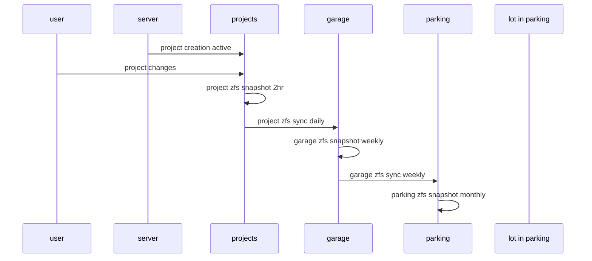
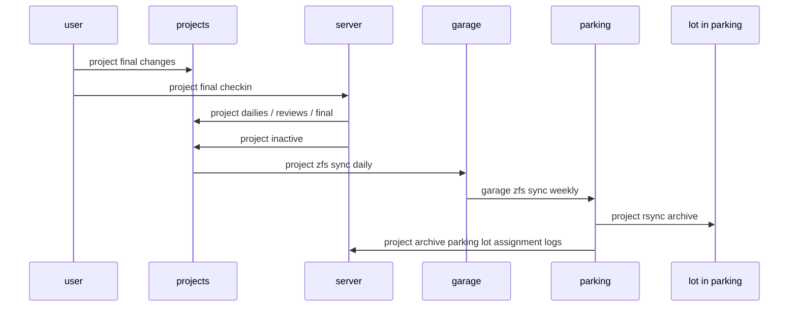
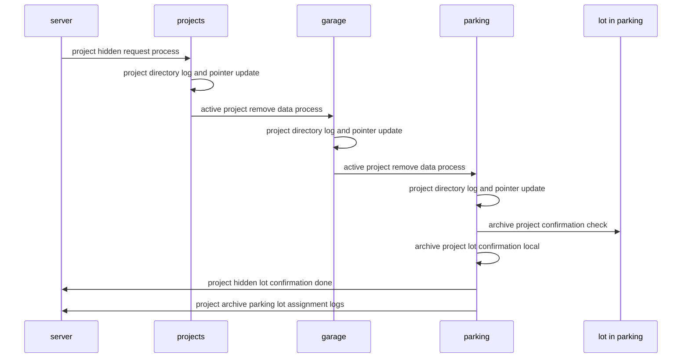
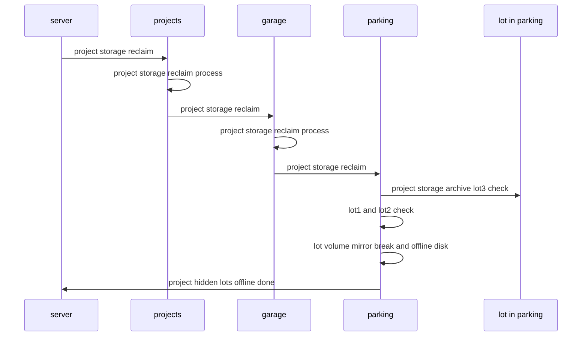

# netstack project data lifecycle

- repo tree active or creation of new repo

```mermaid
sequenceDiagram
    participant user
    participant server
    participant projects
    participant garage
    participant parking
    participant lot in parking
    server->>projects: project creation active
    user->>projects: project changes
    projects->>projects: project zfs snapshot 2hr
    projects->>garage: project zfs sync daily
    garage->>garage: garage zfs snapshot weekly
    garage->>parking: garage zfs sync weekly
    parking->>parking: parking zfs snapshot monthly
```
- project inactive and/or project release

```mermaid
sequenceDiagram
    user->>projects: project final changes
    user->>server: project final checkin
    server->>projects: project dailies / reviews / final
    server->>projects: project inactive
    projects->>garage: project zfs sync daily
    garage->>parking: garage zfs sync weekly
    parking->>lot in parking: project rsync archive
    parking->>server: project archive parking lot assignment logs
```
- project hidden

```mermaid
sequenceDiagram
    server->>projects: project hidden request process
    projects->>projects: project directory log and pointer update
    projects->>garage: active project remove data process
    garage->>garage: project directory log and pointer update
    garage->>parking: active project remove data process
    parking->>parking: project directory log and pointer update
    parking->>lot in parking: archive project confirmation check
    parking->>parking: archive project lot confirmation local
    parking->>server: project hidden lot confirmation done
    parking->>server: project archive parking lot assignment logs
```
- project archive resource reclaim

```mermaid
sequenceDiagram 
    server->>projects: project storage reclaim
    projects->>projects: project storage reclaim process
    projects->>garage: project storage reclaim
    garage->>garage: project storage reclaim process
    garage->>parking: project storage reclaim
    parking->>lot in parking: project storage archive lot3 check
    parking->>parking: lot1 and lot2 check
    parking->>parking: lot volume mirror break and offline disk
    parking->>server: project hidden lots offline done
```
