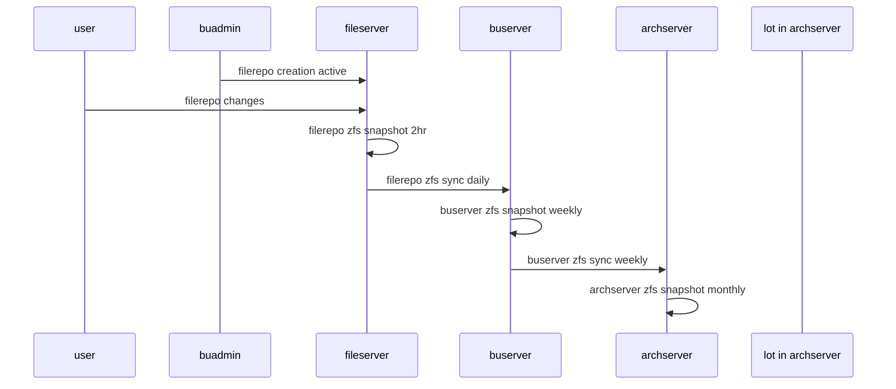
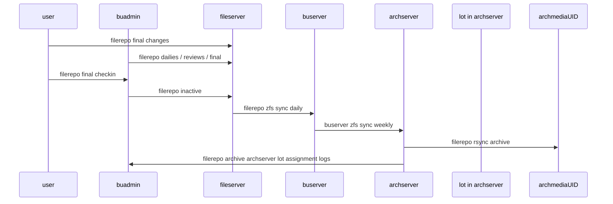
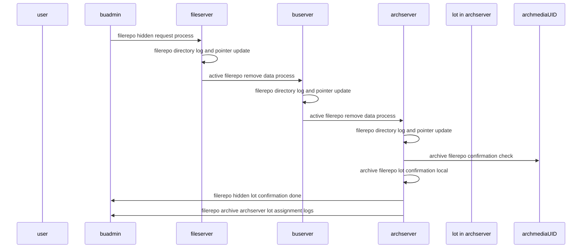
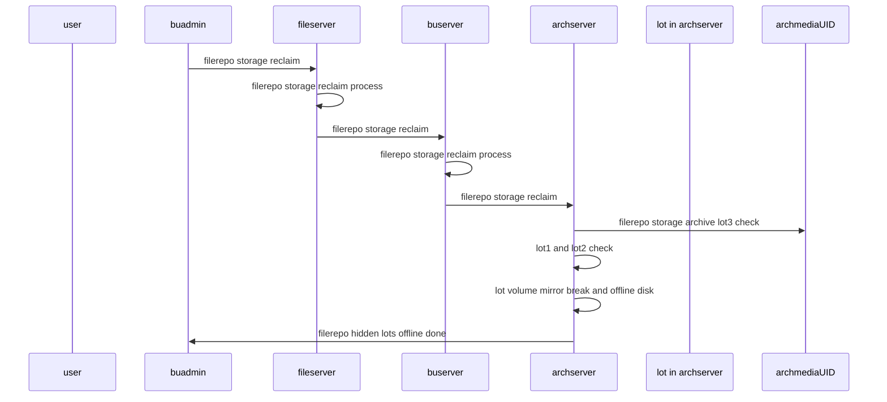

# netstack filerepo data lifecycle

- repo tree active or creation of new repo

```mermaid
sequenceDiagram
    participant user
    participant buadmin
    participant fileserver
    participant buserver
    participant archserver
    participant lot in archserver
    buadmin->>fileserver: filerepo creation active
    user->>fileserver: filerepo changes
    fileserver->>fileserver: filerepo zfs snapshot 2hr
    fileserver->>buserver: filerepo zfs sync daily
    buserver->>buserver: buserver zfs snapshot weekly
    buserver->>archserver: buserver zfs sync weekly
    archserver->>archserver: archserver zfs snapshot monthly
```
- filerepo inactive and/or filerepo release

```mermaid
sequenceDiagram
    participant user
    participant buadmin
    participant fileserver
    participant buserver
    participant archserver
    participant lot in archserver
    user->>fileserver: filerepo final changes
    buadmin->>fileserver: filerepo dailies / reviews / final
    user->>buadmin: filerepo final checkin
    buadmin->>fileserver: filerepo inactive
    fileserver->>buserver: filerepo zfs sync daily
    buserver->>archserver: buserver zfs sync weekly
    archserver->>archmediaUID: filerepo rsync archive
    archserver->>buadmin: filerepo archive archserver lot assignment logs
```
- filerepo hidden

```mermaid
sequenceDiagram
    participant user
    participant buadmin
    participant fileserver
    participant buserver
    participant archserver
    participant lot in archserver
    buadmin->>fileserver: filerepo hidden request process
    fileserver->>fileserver: filerepo directory log and pointer update
    fileserver->>buserver: active filerepo remove data process
    buserver->>buserver: filerepo directory log and pointer update
    buserver->>archserver: active filerepo remove data process
    archserver->>archserver: filerepo directory log and pointer update
    archserver->>archmediaUID: archive filerepo confirmation check
    archserver->>archserver: archive filerepo lot confirmation local
    archserver->>buadmin: filerepo hidden lot confirmation done
    archserver->>buadmin: filerepo archive archserver lot assignment logs
```
- filerepo archive resource reclaim

```mermaid
sequenceDiagram 
    participant user
    participant buadmin
    participant fileserver
    participant buserver
    participant archserver
    participant lot in archserver
    buadmin->>fileserver: filerepo storage reclaim
    fileserver->>fileserver: filerepo storage reclaim process
    fileserver->>buserver: filerepo storage reclaim
    buserver->>buserver: filerepo storage reclaim process
    buserver->>archserver: filerepo storage reclaim
    archserver->>archmediaUID: filerepo storage archive lot3 check
    archserver->>archserver: lot1 and lot2 check
    archserver->>archserver: lot volume mirror break and offline disk
    archserver->>buadmin: filerepo hidden lots offline done
```
