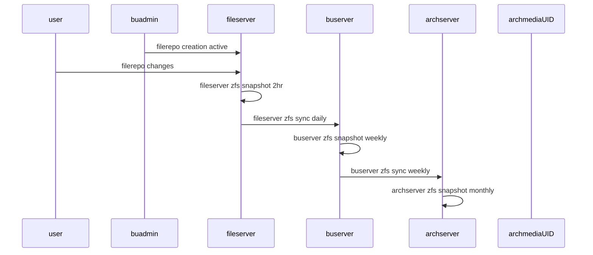
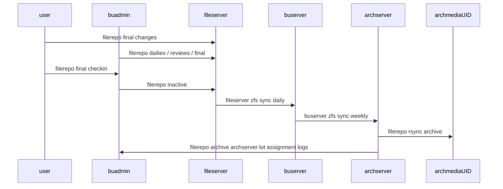
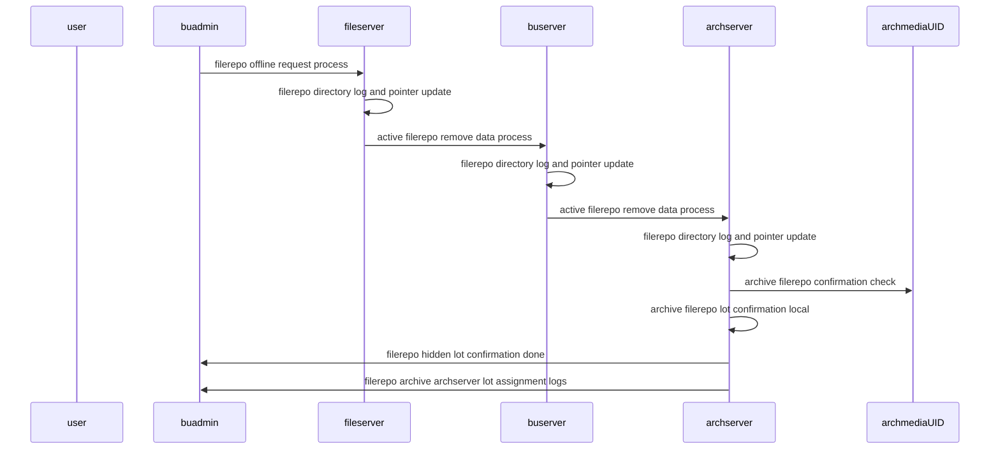
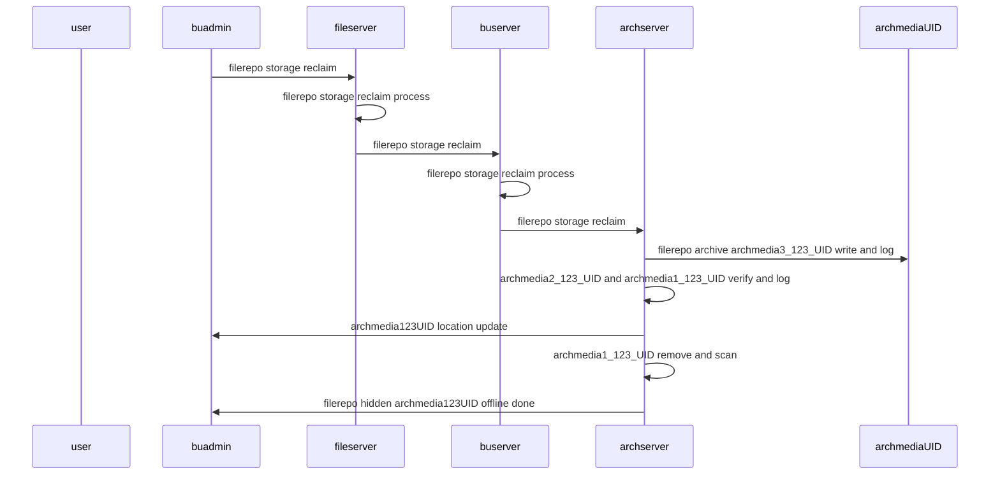

# netstack filerepo data lifecycle

- repo tree active or creation of new repo tree

- filerepo inactive and/or filerepo release to archive

- filerepo request to offline (hide repo and mark to create offline archmedia_123 pack)

- filerepo archmedia offline and notify resource reclaim

