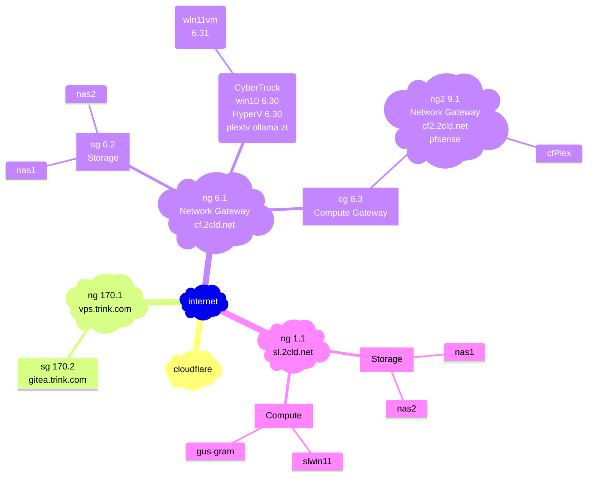
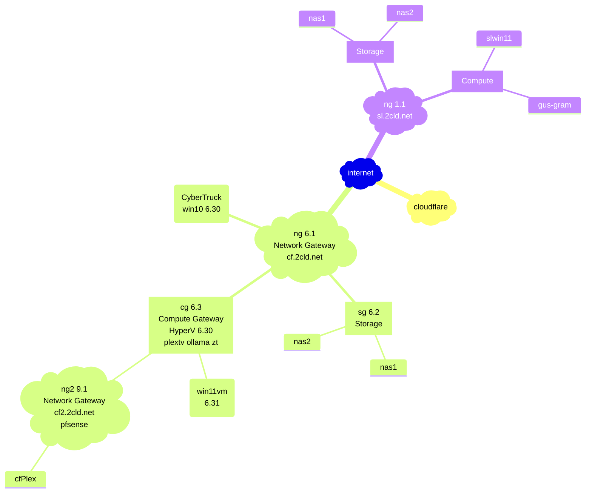
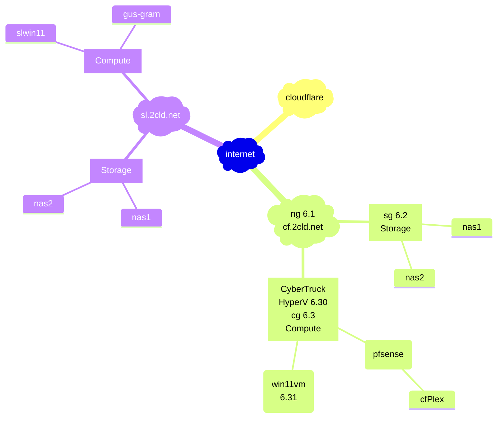
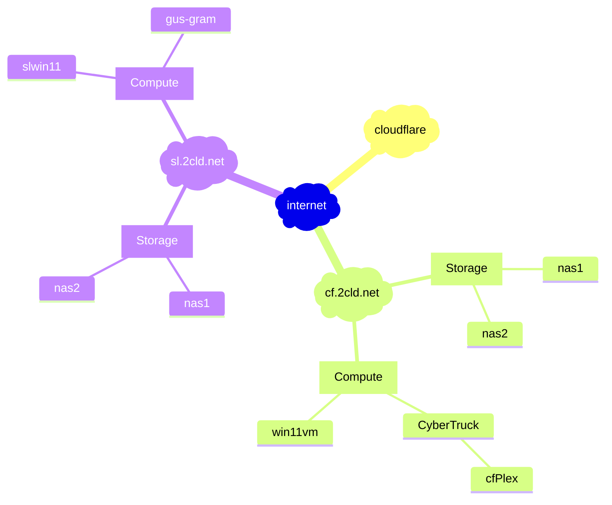

[edit](https://github.com/2cld/netstack/edit/master/docs/ops/deployments/README.md)

- [gh.2cld.lan](https://gh.2cld.net/)
  - [docs](https://gh.2cld.net/docs/)
- [cf.2cld.net](https://cf.2cld.net/)
  - [docs](https://cf.2cld.net/docs)
  - [cf.2cld.lan](https://cf.2cld.net/)
- [sl.2cld.lan](https://sl.2cld.net/)
  - [docs](https://sl.2cld.net/docs/)
- [tv.2cld.lan](https://tv.2cld.net/)
  - [docs](https://tv.2cld.net/docs/)

WIP:
1. Look at IPv6 connectivity (goal gitea access)
2. Get direct access to tuners working (goal no plex)
  - Look at NAS (look at direct recording to NAS)
  - mermaid live edit [link](https://mermaid.live/edit#pako:eNqtksFqAjEQhl9lyckFFfS4V3stFPRUt4cxmcRgklkmSa2I796sW7uV4qX0tvPl5x--Zc5CkkLRCG-D8tC1oaqYKNU2JOSAadKTprGSwkRDpWEmHWVV97hES6K-Au2AcTLQh3Gpg6mlni-lU_Nb-fAQzXadiMHg2w3e1ShIsIOI9e21qgLExd20HOuk2a7Idzk9qCvLj8SH2dEyqh-dq9MOecNZHkY2NL44_BjZ0YbF4t2P4N55WM1fxdEV7eh-a0f3r9rR_VU7uqvQCEyOM8PwSNBBl6grBWIqPLIHq8oNnft0K9IePbaiKZ8KNWSXWtGGS4lCTrQ-BSmaxBmngimbvWg0uFim3BVbfLLQL_6mHYRXonFGZcsPex6u9nq8l08kmNl_)
  - mermaid trink add live edit [link](https://mermaid.live/edit#pako:eNqtVE2P2jAQ_SuWTyBBmg--ElW9UKm9tKq0VQ9dehiciTfCsSPbgWUR_71OTBZ2BaiHnuIZz3tv_GaUA2UqR5rRqpR5BfVKEqKVssNSWtQS7aDNZFnJlBwUQAoYM6GafNimXamrGHaJQoDGgc9eKW_TFxDJSTQPg-jjWn_4tK1NYHUpNwFT1W0Kf0GI8di4w_LSIpzRvoYVkrcSs5PAd7Q7pTfkC1jcwb7LsSKImciD_onvJKWHjHelxrM0Kwx_NC2xV3-wSgPHP_39G4ocLKzB4CuaEAkmehPFfbTcr1H_1A3bDM7HTmNXyih0iknYhV_3Nepf57gW-Gy3RAkBFZAXO7zai7OmbtxAL3ppeaNtNTh9OzLHGl2U3KdgBeOPrDUj6cBLX9C7fN0UjqDNhURdGJTOI8ljkt4dV_w6L_9uD-zOgxstXx9i3_0P55zPGeH3JTo1YMTd3Xi3jsLtxP9bBCOcqycr_81CI7oRnhO8MWOuobrhioDaqtoR0BHlusxpZnWDI1qhrqAN6aFFrqh9wgpXNHPHHAtohF3RlTw6WA3yt1JVj9Sq4U80K0AYFzW1ezB-LqHtoS-BxqqHvWR97BhodqDPNEuSNJin6WKSpLNJGKWz2YjuXXoRLOaT1N3Mk2Qeh8n0OKIvnWjobqYjinnpXP_mf1_dX8x1gjJHvVSNtDSbHv8CQvZ7mQ)
  - see diagram rendered via [github](https://github.com/2cld/netstack/tree/master/docs/ops/deployments)

[](https://mermaid.live/edit#pako:eNqtVMGO2jAQ_ZXIpyBB6iQLIVHVC5XaS6tKW_XQpQfjTLwRjh3ZDiyL-Pc6NgF2BaiHnuJ5mTdv_GaSPaKyBFSgphZlQ9qlCAIlpRnVwoASYMIeKYqaShFWJKjIhHLZlaMetqk2Y-SAihMFoUevpPfwBUWwIM5wFH9cqQ-fNq2OjKrFOqKyuV3CvwgC7bmJ47LaADmzfQ6tBOslZkeB72C2Uq2DL8TAluwcRqsoobyMhiu-kxSeMtnWCs7StNLsSfeFvfqjkYow-DO8f1OiJIasiIYTOwgE0fGbKBmixW4F6qfq6Do8H53GthYxtoopduHXXQvq1zluObyYTSA5Jw0JXs3oai_WmrazA73opa8bb5rw-HTFbNX4IuV-CVpR9kR7M1JHXviEweXrpjAgSl9ItJUGYT0SLAnyu-NKTvPy9_ZEdw5vtHx9iEP3P6xzHtPc70t8bEDzu7vxbh253Yn_twiaW1ePVv6bhZq7EZ4B1ukJU6S54QonrZHtCI1RA6ohdWm__n2fu0TmGRpYosIeS6hIx80SLcXBppLOyMedoKgwqoMxUrJjz6ioCNc26lp7R_hck172hLZE_JayGShQ1talb_534_46Y8RUL38sCaIEtZCdMKhIUsdHxR692Gj6EM3xfP6As8w-82SMdqhIp1GMs9ksnyWzNMZJehijVyeIo3k2xRjHcZ7gPJnn2eEvWWZ9WA)

<!-- version 20250219pm

-->

<!-- version 20250219

-->

<!-- version 20250218

-->
