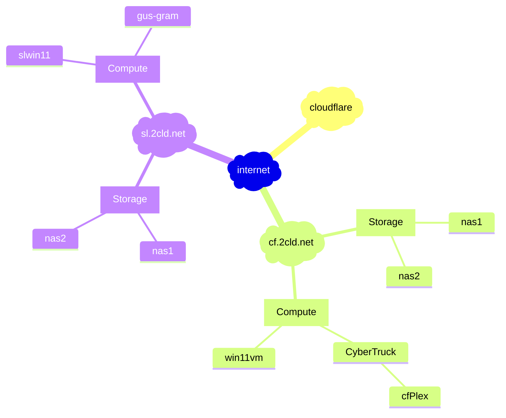

[edit](https://github.com/2cld/netstack/edit/master/docs/ops/deployments/README.md)

- [gh.2cld.lan](https://gh.2cld.net/)
  - [docs](https://gh.2cld.net/docs/)
- [cf.2cld.net](https://cf.2cld.net/)
  - [docs](https://cf.2cld.net/docs)
  - [cf.2cld.lan](https://cf.2cld.net/)
- [sl.2cld.lan](https://sl.2cld.net/)
  - [docs](https://sl.2cld.net/docs/)
- [tv.2cld.lan](https://tv.2cld.net/)
  - [docs](https://tv.2cld.net/docs/)

WIP:
1. Look at IPv6 connectivity (goal gitea access)
2. Get direct access to tuners working (goal no plex)
  - Look at NAS (look at direct recording to NAS)
 

