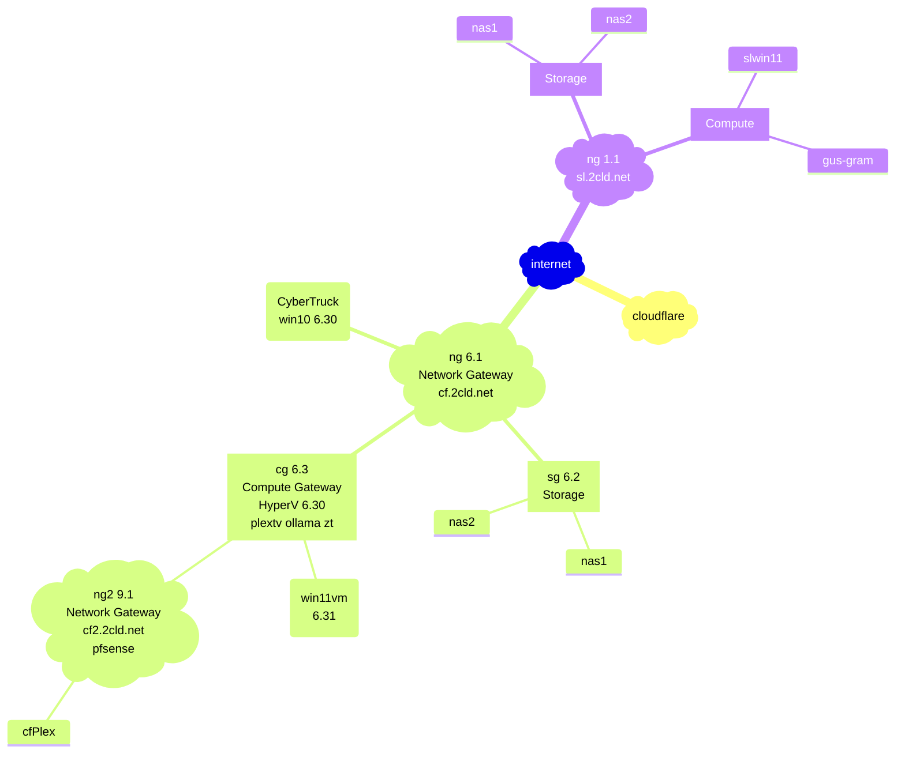
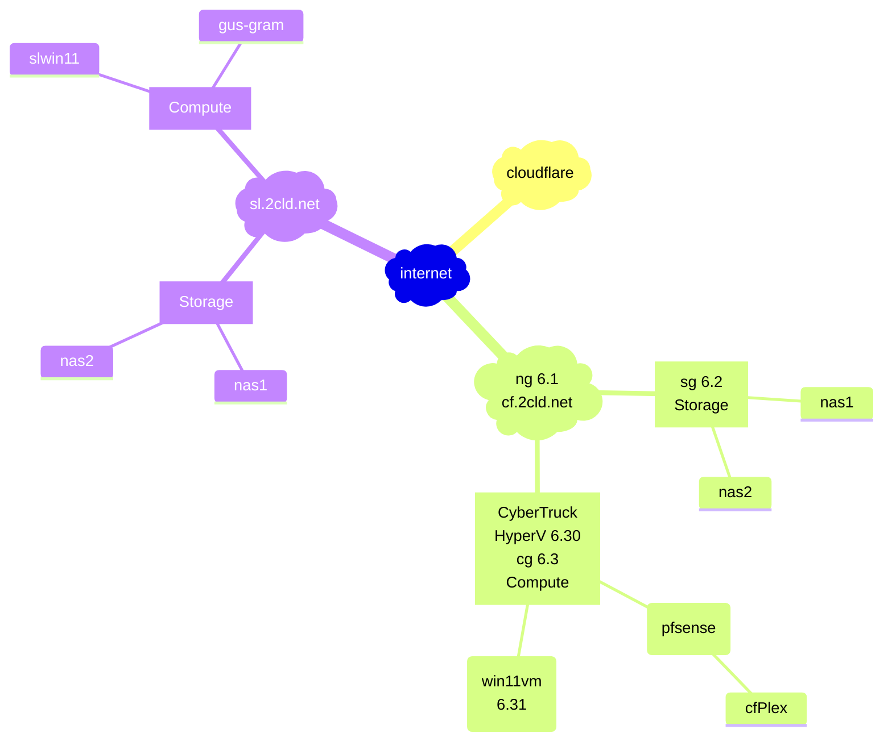
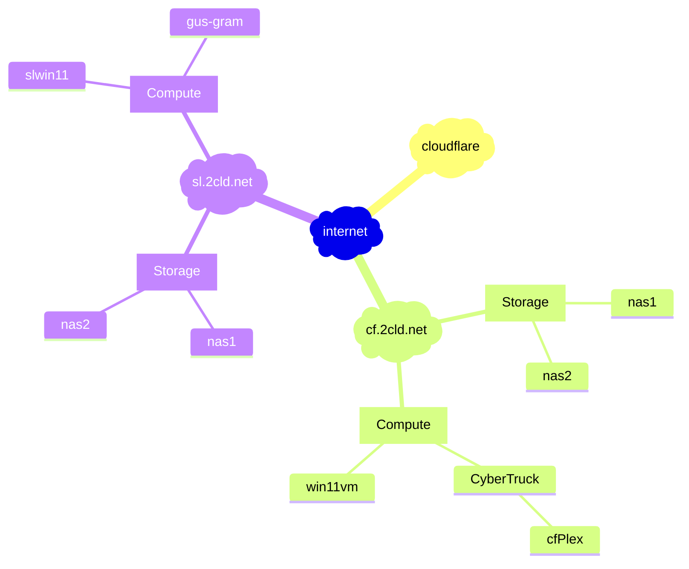

[edit](https://github.com/2cld/netstack/edit/master/docs/ops/deployments/README.md)

- [gh.2cld.lan](https://gh.2cld.net/)
  - [docs](https://gh.2cld.net/docs/)
- [cf.2cld.net](https://cf.2cld.net/)
  - [docs](https://cf.2cld.net/docs)
  - [cf.2cld.lan](https://cf.2cld.net/)
- [sl.2cld.lan](https://sl.2cld.net/)
  - [docs](https://sl.2cld.net/docs/)
- [tv.2cld.lan](https://tv.2cld.net/)
  - [docs](https://tv.2cld.net/docs/)

WIP:
1. Look at IPv6 connectivity (goal gitea access)
2. Get direct access to tuners working (goal no plex)
  - Look at NAS (look at direct recording to NAS)
  - mermaid live edit [link](https://mermaid.live/edit#pako:eNqtksFqAjEQhl9lyckFFfS4V3stFPRUt4cxmcRgklkmSa2I796sW7uV4qX0tvPl5x--Zc5CkkLRCG-D8tC1oaqYKNU2JOSAadKTprGSwkRDpWEmHWVV97hES6K-Au2AcTLQh3Gpg6mlni-lU_Nb-fAQzXadiMHg2w3e1ShIsIOI9e21qgLExd20HOuk2a7Idzk9qCvLj8SH2dEyqh-dq9MOecNZHkY2NL44_BjZ0YbF4t2P4N55WM1fxdEV7eh-a0f3r9rR_VU7uqvQCEyOM8PwSNBBl6grBWIqPLIHq8oNnft0K9IePbaiKZ8KNWSXWtGGS4lCTrQ-BSmaxBmngimbvWg0uFim3BVbfLLQL_6mHYRXonFGZcsPex6u9nq8l08kmNl_)
  - see diagram rendered via [github](https://github.com/2cld/netstack/tree/master/docs/ops/deployments)

[](https://mermaid.live/edit#pako:eNqtVMtO3DAU_RXLq0RipiRIlRqhbqgEm1ZIoC4gXdxxbkyEX_KDYUD8O7YzmUc1M-qiq_gen3vuM36nTHdIGyoH1UkwrSLEau3LQXm0Cn2RkKYZmFZFD6SHGRM6dGWCIzUyygz0AiwWI3qUznrFS8XJ13l1ubBfvv9Cv9T2mVyDxyWsMsb6ec1EN59i_yWnRpfZcrA4ySZhxx9dEq6zyJ3XFjj-me73JDrwsACHG29CFLhqz6on62q1QHtvA3sutsccYzmo6jxGvDgvD4ZhWpoQm7iTJOOPLCV5kQWuRsJe9Tcrg_Z3Vs22EfjqX4gWAiSQN3-4Io5g3U45KbXqRRbrb1aKktUO5XSqhJjeoYo9Urwm306Oq97Ma8x4dMzn4ki8w0OcunQbax4xJ8Z9qdYJOHFyN3ZXLTnHnfh_i-BEnN56ZP82BSdy_7cAD27GLcgjXRFgvDZRgJ5RiVbC0MUf8z2xW-qfUGJLm3jssIcgfEtb9RGpELy-WylGG28DnlGrA3-iTQ_CRSuYWCX-GCAF3qAG1IPWWxu7ITbq5_gU5Bfh4xPR9kQJ)

<!-- version 20250219pm

-->

<!-- version 20250219

-->

<!-- version 20250218

-->
