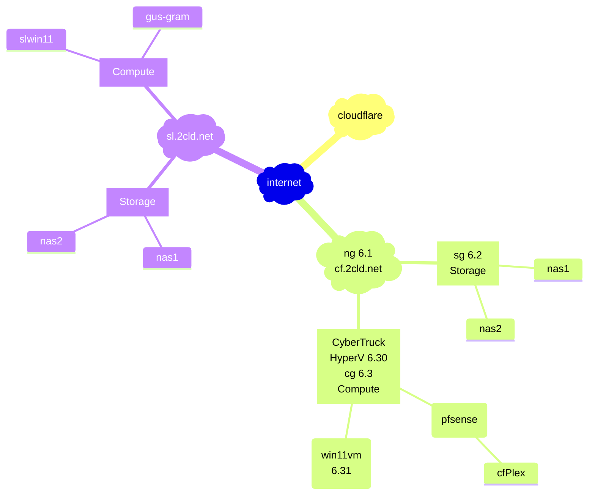
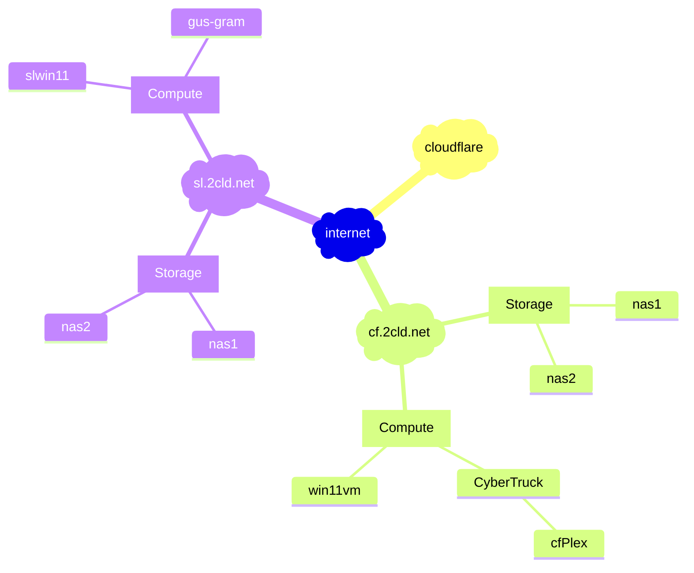

[edit](https://github.com/2cld/netstack/edit/master/docs/ops/deployments/README.md)

- [gh.2cld.lan](https://gh.2cld.net/)
  - [docs](https://gh.2cld.net/docs/)
- [cf.2cld.net](https://cf.2cld.net/)
  - [docs](https://cf.2cld.net/docs)
  - [cf.2cld.lan](https://cf.2cld.net/)
- [sl.2cld.lan](https://sl.2cld.net/)
  - [docs](https://sl.2cld.net/docs/)
- [tv.2cld.lan](https://tv.2cld.net/)
  - [docs](https://tv.2cld.net/docs/)

WIP:
1. Look at IPv6 connectivity (goal gitea access)
2. Get direct access to tuners working (goal no plex)
  - Look at NAS (look at direct recording to NAS)
  - mermaid live edit [link](https://mermaid.live/edit#pako:eNqtksFqAjEQhl9lyckFFfS4V3stFPRUt4cxmcRgklkmSa2I796sW7uV4qX0tvPl5x--Zc5CkkLRCG-D8tC1oaqYKNU2JOSAadKTprGSwkRDpWEmHWVV97hES6K-Au2AcTLQh3Gpg6mlni-lU_Nb-fAQzXadiMHg2w3e1ShIsIOI9e21qgLExd20HOuk2a7Idzk9qCvLj8SH2dEyqh-dq9MOecNZHkY2NL44_BjZ0YbF4t2P4N55WM1fxdEV7eh-a0f3r9rR_VU7uqvQCEyOM8PwSNBBl6grBWIqPLIHq8oNnft0K9IePbaiKZ8KNWSXWtGGS4lCTrQ-BSmaxBmngimbvWg0uFim3BVbfLLQL_6mHYRXonFGZcsPex6u9nq8l08kmNl_)
  - see diagram rendered via [github](https://github.com/2cld/netstack/tree/master/docs/ops/deployments)

[](https://mermaid.live/edit#pako:eNqtUztvwjAQ_iuRp0QC2oDUIaq60KFLpUpUHUo6HM7FWPgR-VGKEP-9dkIKVArq0Mm-7-6-7x72nlBdISmI5KqS0JQqSYzWLuPKoVHo0ogUBadapTUkNYyp0L7KIhxCQ0TWArUAg2mHDobTWrFMseRukt-vzM0DrSdTKqpJr_MrNcBbbTbjLTfYU0QSy5Y2kkxbkoXTBhh-9P4LigocrMDiT3aSKLD5hTU9MVO2nO9WaF6Np5uW_WnXoHkLYrPbruQoPGuvcy0b7waEGYKxZ6pNbVFZTI_nmecPLfflvQj8OmFbrvL8U6bHs60p1JYPcdOuXnP0WxGWYcXVDZwvL2aEyf_fuK2I4742xKFpWNH2fAKYt2NmQA50LqBxugkEZEQkGgm8Ck9-H6NL4tYosSRFuFZYgxeuJKU6hFDwTi92ipLCGY8jYrRna1LUIGywfBO6xUcOUfgHbUC9a32yseJhYM_dJ2v_2uEbcmYO9Q)
<!-- version 20250219

-->

<!-- version 20250218

-->
