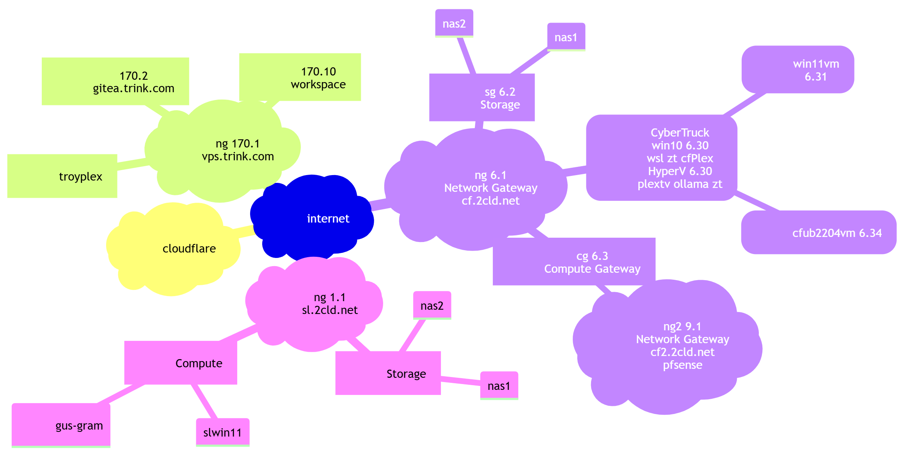
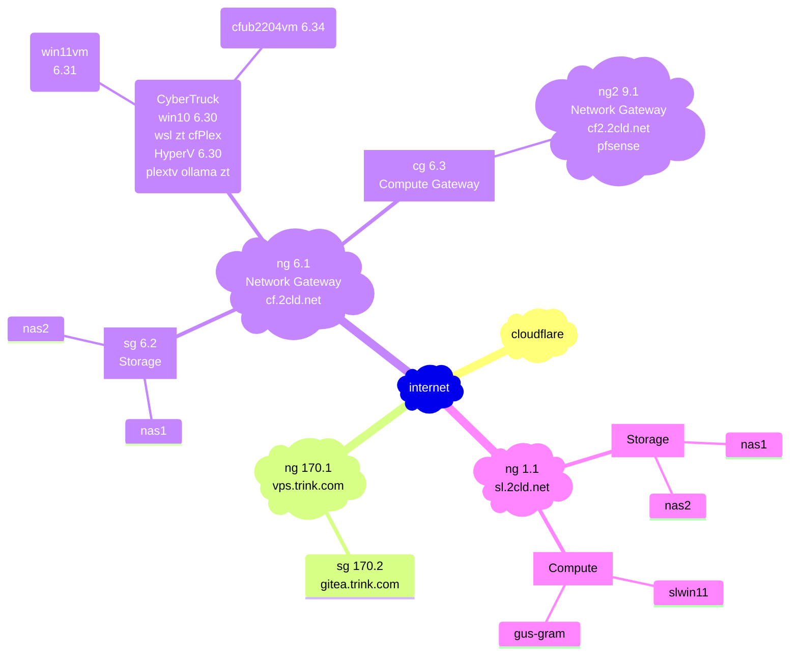
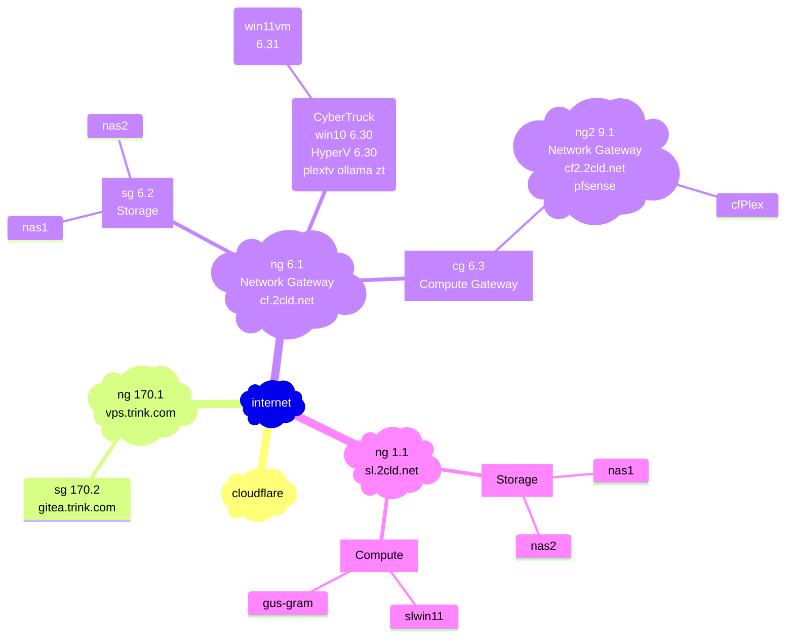
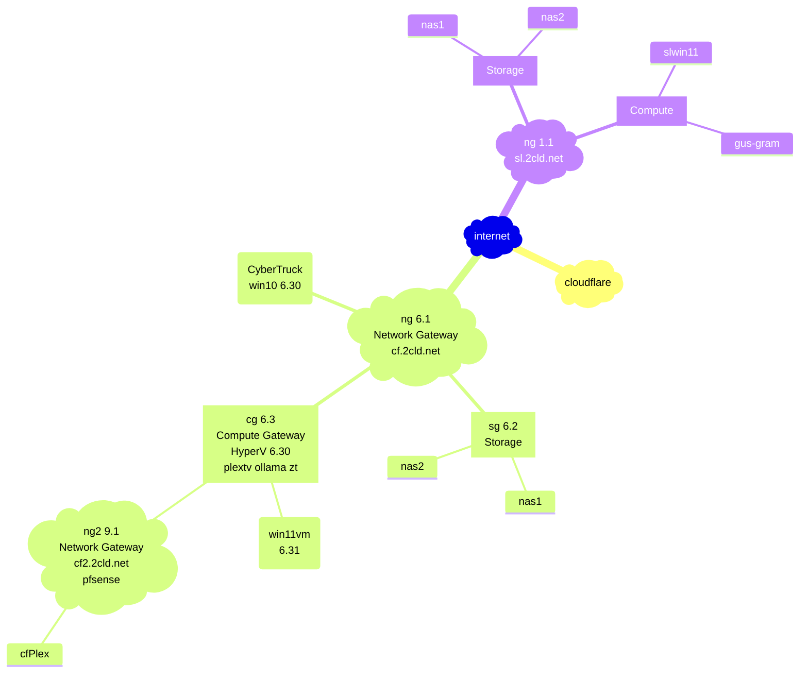
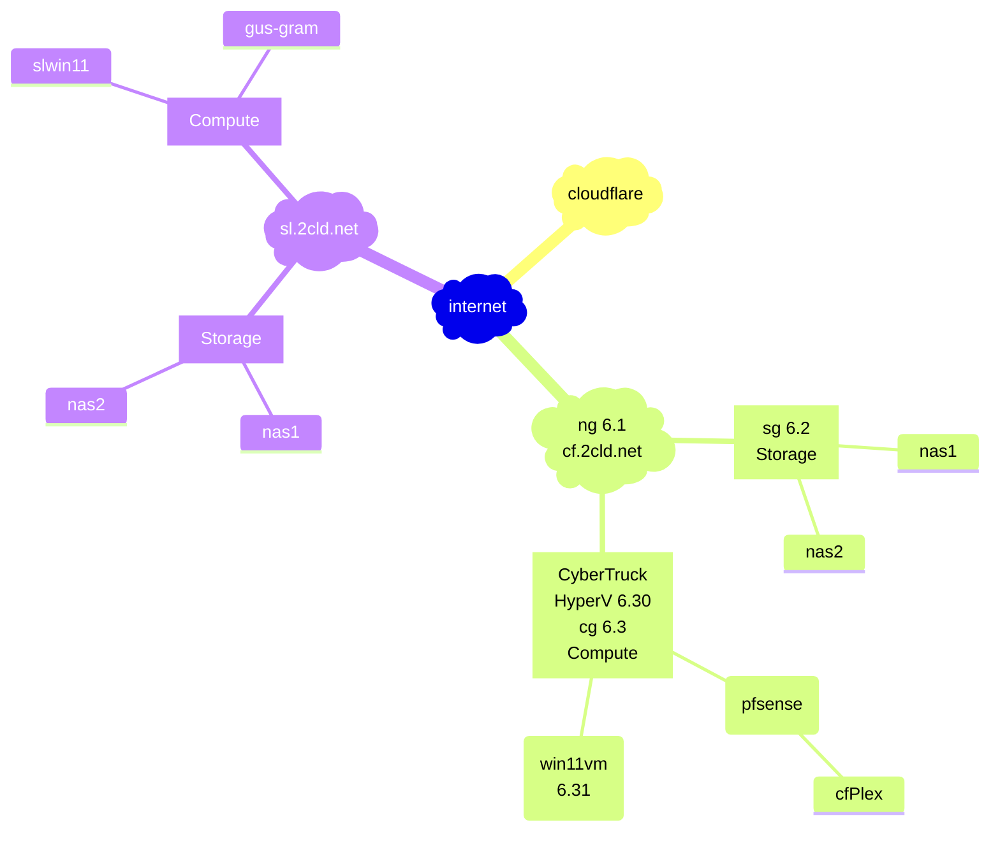
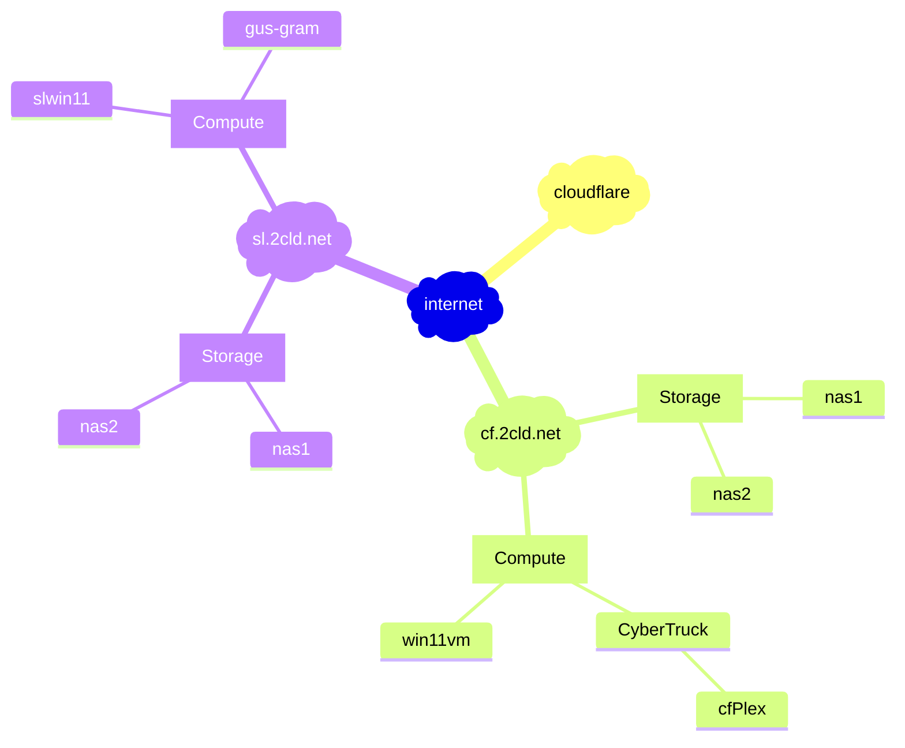

[edit](https://github.com/2cld/netstack/edit/master/docs/ops/deployments/README.md)

- [gh.2cld.lan](https://gh.2cld.net/)
  - [docs](https://gh.2cld.net/docs/)
- [cf.2cld.net](https://cf.2cld.net/)
  - [docs](https://cf.2cld.net/docs)
  - [cf.2cld.lan](https://cf.2cld.net/)
- [sl.2cld.lan](https://sl.2cld.net/)
  - [docs](https://sl.2cld.net/docs/)
- [tv.2cld.lan](https://tv.2cld.net/)
  - [docs](https://tv.2cld.net/docs/)

WIP:
1. Look at IPv6 connectivity (goal gitea access)
2. Get direct access to tuners working (goal no plex)
  - Look at NAS (look at direct recording to NAS)
  - mermaid live edit [link](https://mermaid.live/edit#pako:eNqtksFqAjEQhl9lyckFFfS4V3stFPRUt4cxmcRgklkmSa2I796sW7uV4qX0tvPl5x--Zc5CkkLRCG-D8tC1oaqYKNU2JOSAadKTprGSwkRDpWEmHWVV97hES6K-Au2AcTLQh3Gpg6mlni-lU_Nb-fAQzXadiMHg2w3e1ShIsIOI9e21qgLExd20HOuk2a7Idzk9qCvLj8SH2dEyqh-dq9MOecNZHkY2NL44_BjZ0YbF4t2P4N55WM1fxdEV7eh-a0f3r9rR_VU7uqvQCEyOM8PwSNBBl6grBWIqPLIHq8oNnft0K9IePbaiKZ8KNWSXWtGGS4lCTrQ-BSmaxBmngimbvWg0uFim3BVbfLLQL_6mHYRXonFGZcsPex6u9nq8l08kmNl_)
  - mermaid trink add live edit [link](https://mermaid.live/edit#pako:eNqtVMGO2yAU_BXEKZES1xDHjq2ql1RqL60qbdVDNz0QjFkrGCzAyWaj_fdiSOLsKtnuoSfDMG_meXjiAKkqGSxgU8uyIe1KAqCVsuNaWqYls6MeKYqaKjmqCKjIlArVleMedlTHGHugEkSzUUCv0Hv4okRygLI4Qh_X-sOnbWsiq2u5iahqbkuEAwBMqMW-lteWkaE6cGgleW-RHg2-M7tTegO-EMt2ZO8xWkWYijI6_eIrSxlKprtas8GaVobfm144uN9ZpQlnf07nLyRKYsmaGHauBkASg17s8Gm33K-Z_qk7uhkNS--xqyWKneMsDlsjwJN1nfwQ7NEjX_ct078GRusO7BYoIUhDHHd8tTsXVtu5K77orndC22Z0_Hoxp4ouKP-SoFW3xjhOnMqw7FtL3i1CK8rvaZ_xzHewDITT5V3PmjOizYVFWxkmXfSSY5C_OQX4PAYhvFDo16MbLV-bDSPCyKGjmRFvjteriRZurP7fLBnhEjzG9r64jPB3PgC8M1OuSXMjAUFaq9oxnMCG6YbUpXtADj13Be0Da9gKFm5Zsop0wq7gSj47KumsuttLCgurOzaBWnX8ARYVEcbtutb9I_tck972jLZE_laqOZWwsnYpfQsvln-4JpDr3v4oyWTJ9FJ10sICZdgLwOIAH2GBMxwlCCV5lqfzPF3M5hO4h0UaJXmKFhglaJHEeJE-T-CTt4yjPEkWcTLL0DzFWZLh579rC5Kp)
  - see diagram rendered via [github](https://github.com/2cld/netstack/tree/master/docs/ops/deployments)

## Network Diagram [edit](https://mermaid.live/edit#pako:eNqtlFFvmzAQx78K8lMiJQwDgQRNe8mk7WXTpE57aLIHxxgX1djINmnTqt99ZwNJO9GtmvbE-Xz3v_PPhx8RVSVDBWpqWTak3csg0ErZeS0t05LZmfMURU2VnFUkqMiSCtWVc-cOAm9Xgmi2hNj5ZTnr9ycSnbvftLqWtz5P8gDnUYjfH_S7D8fWhH4rpKqZ0oGMO6Vvl3e1ZmMjg5rhOycUeyFeW0YuUj_HyBdih47_JmFuvAaOvIirZFpC2XQ6QAJyRLzUaAW731mtTs6YTqxq0YwQK8kdgmwA8LU_X_CJWHZHTt5HqzCmogzHG3kTEloBD-OEeyBXVmnCXzlJSSw5EMPO2UEgicEvVvG42p4OTH_XHb2dXcyeVy1xBBWTAZ8RwYOFTr4BCe_5fGqZ_nGJcIjsMVBCkIZA7HyyO7i_tgPYz7pzlfCxmQ1fLwaq-FnI3yRo1R3iOEpB5WK61tI3i9CK8h11jBPfwbYPGC9vmjVnRJtnJdrKMAnoJY-DzR-nID6PQQ-vT_T27JWWp2bDiH7k8FDMiH8YLyNgvP7fTBkBJAd8b8NmhL_7i4N3Zsk1aV4hIUhrVQsCaIEa-HFJXcLL9-ii98jesIbtUQFmySrSCbtHe_kEoaSz6uokKSqs7tgCadXxG1RURBhYdS2ckn2siSt89rZEXivVjCmsrIHTl_6p9S_uAnHtyg-STJZMb1UnLSqyNPUCqHhE96hI1iFepTjeRHmUxMkGNk-owPEqzFab9WqN02wVZ-vsaYEefMkozJJNnuUYR0ma52m-fvoFJVXP-Q)

--- image downlad

--- markdown

[](https://mermaid.live/edit#pako:eNqtlFFv2yAQx7-KxVMiJR7GiZNY014yaXvZNKnTHtrs4YIxtYrBApw0jfrdB9hu2sndqmlPPo67_x0_zpwRVQVDOaorWdTQ7GQUaaXstJKWacnsxHvyvKJKTkqISphTodpi6t1RFOxSgGZzFzu9LCfd_kiid3ebVlfyLuRJHiUrHCfv9_rdh0Nj4rAVU1WP6biMo9J382Ol2dBIr2b4jRciQYhXlsFF6ucQ-UJs3_LfJMxt0EhwEPGVTAOUjac7SI4ciJcajWD3N1arkzfGE8tK1APEUnKPIOsBfO3OF30Cy45wCj5axoSKIh5u5E1IaOl4GC_cAbmySgN_5SQFWNiDYU_ZUSTBJC9WZFhtT3umv-uW3k0uZserkgl2FdMenxHRg3WdfHMkgufzqWH6xyXCI7KHSAkBNbjY6Wh37v6a1sF-1p2vlBzqSf8NYk41eRbyNwlatntC8MKpXEzf2uLNIrSk_IZ6xmnoYNsFDJc3zpoz0OZZiaY0TDr0kpNo88cpIE9j0MHrEoM9eaXlsdkwohu5pC9mxD-MlxFuvP7fTBnhSPb43obNiHD3FwdvzZxrqF8hIaCxqnECaIZq9-NCVbiX7-yjd8jesprtUO7MgpXQCrtDO_noQqG16uokKcqtbtkMadXyW5SXIIxbtY07JftYgS88hDQgr5V6WrKicpi-dC9teHBniGtfvVdksmB6q1ppUU5IyEf5Gd2jPM3ibJMtySJNcYZxOkMnlC-X8Wq5STOSrNeELPDmcYYeQj0cr0mCyXKxwasMr3FKHn8B533O7Q)

--- VVV png

--- VVV svg

--- VVV not sure

[](https://mermaid.live/edit#pako:eNqtlFFvmzAQx78K8lMiJQwDJRRNe8mk7WXTpE57aLIHxxgX1djINmnTqt99ZwNJO5EtmvbE-Xz3v_PPh58RVSVDBWpqWTak3cog0ErZeS0t05LZmfMURU2VnFUkqMiSCtWVc-cOAm9Xgmi2hNj5aTnr9ycSnbvftLqW9z5P8gCvohC_3-l3H_atCf1WSFUzpQMZD0rfLx9qzcZGBjXDN04o9kK8toycpH6OkW_Edh3_TcLceQ0ceRFXybSEsul0gATkiHir0Qr2uLFaHZwxnVjVohkhVpI7BNkA4Gt_vuATseyBHLyPVmFMRRmON3IREloBD-OEeyA3VmnCz5ykJJbsiGHH7CCQxOA3q3hcrQ87pr_rjt7PTmbPq5Y4gorJgM-I4MlCJ9-AhPd8PrRM_zhFOER2HyghSEMgdj7ZHdxf2wHsV925SnjfzIavFwNV_CrkbxK06nZxHKWgcjJda-nFIrSifEMd48R3sO4DxsubZs0Z0eZVibYyTAJ6yePg-o9TEB_HoIfXJ3p7dqblqdkwoh85PBQz4h_GywgYr_83U0YAyQHfZdiM8Hd_cvDOLLkmzRkSgrRWtSCAFqiBH5fUJbx8zy56i-wda9gWFWCWrCKdsFu0lS8QSjqrbg6SosLqji2QVh2_Q0VFhIFV18Ip2ceauMJHb0vkrVLNmMLKGjh96Z9a_-IuENeu_CDJZMn0WnXSoiJLMy-Aimf0iIokD6MMR2mc4zROousFOqACZ3mYx1m-wqurLME4eVmgJ18wCq_SfBWnWQpbUX6VJi-_AIa3z3w)

--- did that work

--- old diagram
[](https://mermaid.live/edit#pako:eNqtVMGO2yAU_BXEKZES1xDHjq2ql1RqL60qbdVDNz0QjFkrGCzAyWaj_fdiSOLsKtnuoSfDMG_meXjiAKkqGSxgU8uyIe1KAqCVsuNaWqYls6MeKYqaKjmqCKjIlArVleMedlTHGHugEkSzUUCv0Hv4okRygLI4Qh_X-sOnbWsiq2u5iahqbkuEAwBMqMW-lteWkaE6cGgleW-RHg2-M7tTegO-EMt2ZO8xWkWYijI6_eIrSxlKprtas8GaVobfm144uN9ZpQlnf07nLyRKYsmaGHauBkASg17s8Gm33K-Z_qk7uhkNS--xqyWKneMsDlsjwJN1nfwQ7NEjX_ct078GRusO7BYoIUhDHHd8tTsXVtu5K77orndC22Z0_Hoxp4ouKP-SoFW3xjhOnMqw7FtL3i1CK8rvaZ_xzHewDITT5V3PmjOizYVFWxkmXfSSY5C_OQX4PAYhvFDo16MbLV-bDSPCyKGjmRFvjteriRZurP7fLBnhEjzG9r64jPB3PgC8M1OuSXMjAUFaq9oxnMCG6YbUpXtADj13Be0Da9gKFm5Zsop0wq7gSj47KumsuttLCgurOzaBWnX8ARYVEcbtutb9I_tck972jLZE_laqOZWwsnYpfQsvln-4JpDr3v4oyWTJ9FJ10sICZdgLwOIAH2GBMxwlCCV5lqfzPF3M5hO4h0UaJXmKFhglaJHEeJE-T-CTt4yjPEkWcTLL0DzFWZLh579rC5Kp)

<!-- version 20250411pm update

-->
<!-- version 20250411am add vps.trink.com

-->

<!-- version 20250219pm

-->

<!-- version 20250219

-->

<!-- version 20250218

-->
