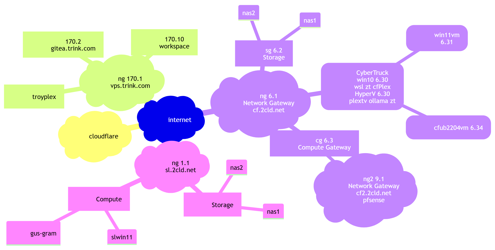

[edit](https://github.com/2cld/netstack/edit/master/docs/ops/deployments/README.md) or [../ops](../) or [../../docs](../../)

# Deployments

Site-specific configurations and network diagrams. Each site has its own repo with full details — netstack holds the summary and cross-site view.

New site? Start from the [site template](./site-template/).

## Sites

| site | subnet | PIP | docs | repo |
|------|--------|-----|------|------|
| [cf](./cf/) (Cedar Falls) | 192.168.6.0/24 | 192.111.21.62 | [cf.2cld.net](https://cf.2cld.net/docs) | [github](https://github.com/2cld/cf) |
| [sl](./sl/) (Silver Lake) | 192.168.0.0/24 + 9.0/24 | 24.216.208.251 | [sl.2cld.net](https://sl.2cld.net/docs) | [github](https://github.com/2cld/sl) |
| [wf](./wf/) (Winfield) | 192.168.254.0/24 | x.x.x.x | - | - |
| gh | - | - | [gh.2cld.net](https://gh.2cld.net/docs/) | - |
| tv | - | - | [tv.2cld.net](https://tv.2cld.net/docs/) | - |

- [CyberTruck](./CyberTruck/) - CyberTruck workstation (at cf site)

## Network Diagram

[Edit diagram on mermaid.live](https://mermaid.live/edit#pako:eNqtlFFvmzAQx78K8lMiJQwDgQRNe8mk7WXTpE57aLIHxxgX1djINmnTqt99ZwNJO9GtmvbE-Xz3v_PPhx8RVSVDBWpqWTak3csg0ErZeS0t05LZmfMURU2VnFUkqMiSCtWVc-cOAm9Xgmi2hNj5ZTnr9ycSnbvftLqWtz5P8gDnUYjfH_S7D8fWhH4rpKqZ0oGMO6Vvl3e1ZmMjg5rhOycUeyFeW0YuUj_HyBdih47_JmFuvAaOvIirZFpC2XQ6QAJyRLzUaAW731mtTs6YTqxq0YwQK8kdgmwA8LU_X_CJWHZHTt5HqzCmogzHG3kTEloBD-OEeyBXVmnCXzlJSSw5EMPO2UEgicEvVvG42p4OTH_XHb2dXcyeVy1xBBWTAZ8RwYOFTr4BCe_5fGqZ_nGJcIjsMVBCkIZA7HyyO7i_tgPYz7pzlfCxmQ1fLwaq-FnI3yRo1R3iOEpB5WK61tI3i9CK8h11jBPfwbYPGC9vmjVnRJtnJdrKMAnoJY-DzR-nID6PQQ-vT_T27JWWp2bDiH7k8FDMiH8YLyNgvP7fTBkBJAd8b8NmhL_7i4N3Zsk1aV4hIUhrVQsCaIEa-HFJXcLL9-ii98jesIbtUQFmySrSCbtHe_kEoaSz6uokKSqs7tgCadXxG1RURBhYdS2ckn2siSt89rZEXivVjCmsrIHTl_6p9S_uAnHtyg-STJZMb1UnLSqyNPUCqHhE96hI1iFepTjeRHmUxMkGNk-owPEqzFab9WqN02wVZ-vsaYEefMkozJJNnuUYR0ma52m-fvoFJVXP-Q)

## External Services (Cloudflare Tunnels)

Cross-site view of all public endpoints. Full tunnel configs live in each site repo.

| public hostname | site | service |
|-----------------|------|---------|
| chat.bradnordyke.com | cf | Open WebUI (ollama) |
| ssh.bradnordyke.com | cf | SSH to cfDVR |
| rt.bradnordyke.com | cf | Rust test |
| gitea.klopfenstein.org | cf | Gitea on cfDVR |
| metube.klopfenstein.org | cf | MeTube on cfDVR |
| sg.klopfenstein.org | cf | cfDVR portal |
| *.cat9.me | cf | traefik via Hyper-V |
| traefik.2cld.com | sl | traefik via slwin11 |
| portainer.2cld.com | sl | portainer via slwin11 |
| gitea.2cld.com | sl | gitea via slwin11 |

## Maintenance Pattern

- Site-specific data (devices, services, IPs) → edit in the site repo (cf, sl, wf)
- Architecture, install guides, portal docs → edit here in netstack
- This deployments index → cross-site summary and links only
