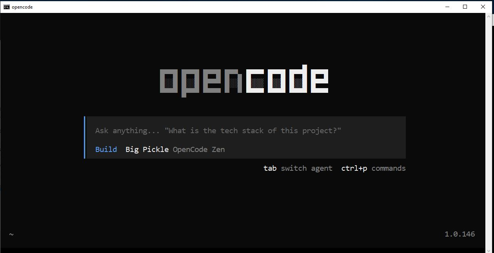

# ai workflows

- nsdockerhv - 10.147.17.176 - 192.168.6.106 - nsadmin

# Kiro
- kiro [install - kiro.dev](kiro.dev) install the latest .deb package from kiro.dev using sudo dpkg -i kiro-cli.deb

# Gemini
- [networkchuck gemini cli](https://github.com/theNetworkChuck/ai-in-the-terminal/blob/main/docs/03-gemini-cli.md)
```
# Install globally with npm
nsadmin@nsdockerhv:~$ sudo apt install nodejs npm
nsadmin@nsdockerhv:~$ sudo npm install -g @google/gemini-cli
```
- it did work after npm and nodejs install
- 
- above did not work I used [this link](https://www.educative.io/answers/how-to-install-google-cloud-cli-on-debian-ubuntu)
- add cert
```
nsadmin@nsdockerhv:~$ sudo apt-get install apt-transport-https ca-certificates gnupg
```
- sources list
```
nsadmin@nsdockerhv:~$ echo "deb [signed-by=/usr/share/keyrings/cloud.google.gpg] https://packages.cloud.google.com/apt cloud-sdk main" | sudo tee -a /etc/apt/sources.list.d/google-cloud-sdk.list
```
- check for no dups
```
nsadmin@nsdockerhv:~$ cat /etc/apt/sources.list.d/google-cloud-sdk.list
```
- keyring
```
nsadmin@nsdockerhv:~$ curl https://packages.cloud.google.com/apt/doc/apt-key.gpg | sudo apt-key --keyring /usr/share/keyrings/cloud.google.gpg add -
```
- install
```
nsadmin@nsdockerhv:~$ sudo apt-get update && sudo apt-get install google-cloud-cli
```
- login
```
nsadmin@nsdockerhv:~$ gcloud init
```
- this will associate a project with a google account


- https://github.com/theNetworkChuck/ai-in-the-terminal

# Open code
- I installed open code and this amused me... Big Pickel Build 

